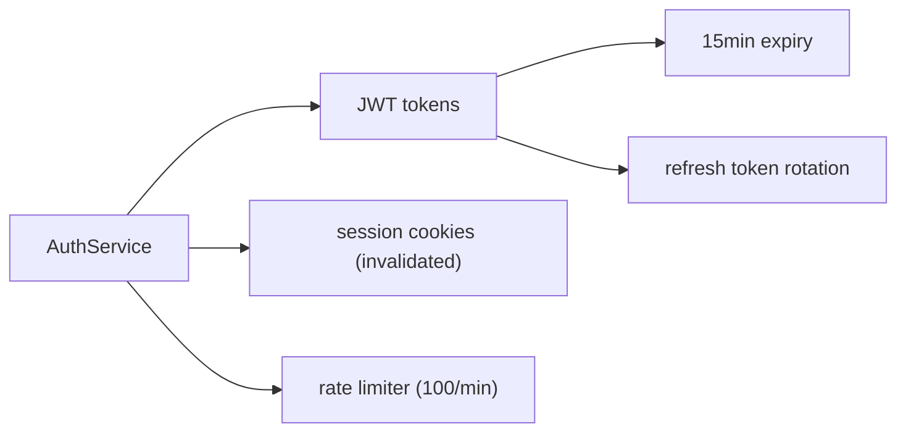

# memrelay

*Memory relay for AI coding agents.*

Graphiti-powered memory for GitHub Copilot CLI. Automatic session memory — no configuration, no memory files, no graph terminology exposed to users.

**Dependency:** memrelay depends on [tracemill](https://github.com/dfinson/tracemill) for event parsing, enrichment, and pipeline infrastructure. Read the tracemill SPEC.md first.

---

## §1 — What It Does

A background daemon observes Copilot CLI sessions, normalizes events through tracemill's EventPipeline, ingests them into Graphiti, and exposes retrieval through an MCP server. Memory accumulates automatically and surfaces relevant context when the agent needs it.

```
Copilot CLI                    MCP Server (stdio)               Daemon (background)
    │                                │                                │
    │  spawns on session start       │  queries daemon via socket     │  tails session files
    │  calls memory_recall           │  formats results               │  normalizes → SessionEvent
    │  receives formatted context    │  returns to agent              │  filters, assembles episodes
    │                                │                                │  ingests into Graphiti
    ▼                                ▼                                ▼
                              ~/.memrelay/daemon.sock
                                      │
                    ┌─────────────────────────────────────┐
                    │           Graphiti Engine            │
                    │                                     │
                    │   Backend: Kuzu (embedded file)      │
                    │   LLM: Copilot CLI (background)     │
                    │   Embeddings: fastembed (local ONNX) │
                    └─────────────────────────────────────┘
```

**The user experience:**

```bash
pip install memrelay
memrelay init
memrelay start
copilot          # memory just works
```

No memory files. No `memory.md`. No manual summaries. No graph terminology. No memory management commands required for normal operation.

---

## §2 — Architecture

Two processes. Separate concerns.

### Observation Daemon

Runs as a background process. Watches for Copilot CLI sessions. Tails their event streams. Normalizes raw CLI events into tracemill's canonical `SessionEvent` schema via adapter + EventPipeline. Filters, assembles episodes, queues for Graphiti ingestion.

**The daemon is the sole owner of the Kuzu database.** Kuzu enforces a file-level exclusive lock — only one process can open a `READ_WRITE` database at a time. The daemon holds this lock for the lifetime of its process.

### MCP Server

Exposes `memory_recall`, `memory_detail`, and `memory_note` tools to the agent. Copilot CLI spawns it via stdio transport when a session starts. Queries the daemon over a local socket for graph results. This is the only interface the agent sees.

The MCP server is **stateless** — it can be spawned and killed freely by Copilot CLI. All state lives in the daemon.

### Process Communication

```
Copilot CLI ←stdio→ MCP Server ←socket→ Daemon ←file→ Kuzu
```

The daemon exposes a lightweight JSON-over-socket query API:

```python
# Daemon listens on ~/.memrelay/daemon.sock (Unix) or named pipe (Windows)
# MCP server connects as a client

# Request
{"method": "search", "query": "auth system", "namespace": "dfinson", "prefer_repo": "dfinson/codeplane"}

# Response
{"nodes": [...], "edges": [...], "scores": [...]}

# Request
{"method": "detail", "node_uuid": "abc-123", "namespace": "dfinson"}

# Response
{"node": {...}, "connected_edges": [...], "episodes": [...]}

# Request
{"method": "note", "content": "The auth system uses JWT now", "namespace": "dfinson", "repo": "dfinson/codeplane"}

# Response
{"status": "ok"}

# Request
{"method": "health"}

# Response
{"status": "running", "sessions_observed": 12, "episodes_ingested": 347, "spool_pending": 0}
```

### Why Two Processes

MCP servers are spawned by Copilot CLI on demand (stdio subprocess). They don't run persistently. Observation must happen independently of whether the agent is active. The daemon ingests continuously; the MCP server retrieves on demand.

### Registration

Copilot CLI discovers MCP servers via `~/.copilot/mcp-config.json`:

```json
{
  "mcpServers": {
    "memrelay": {
      "type": "stdio",
      "command": "memrelay",
      "args": ["mcp"],
      "env": {},
      "tools": ["*"]
    }
  }
}
```

`memrelay init` writes this file (merges with existing entries if present). The built-in GitHub MCP server runs alongside — no conflict. Changes take effect immediately without restarting Copilot CLI.

---

## §3 — Observation & Ingestion

### 3.1 Session Discovery

The daemon polls for active Copilot CLI sessions. It reads `~/.copilot/session-store.db` (or equivalent session directory), filters by active sessions, and discovers session event files.

**Polling interval:** Check for new sessions every 2 seconds. This is acceptable because session creation is infrequent and the check is a lightweight directory listing + DB read.

### 3.2 Event Normalization

Raw Copilot CLI events are parsed by tracemill's `CLIJsonlAdapter`. The daemon feeds raw JSONL lines from session event files to the adapter and receives `SessionEvent` objects.

```python
from tracemill.adapters import CLIJsonlAdapter

adapter = CLIJsonlAdapter()

# Daemon's watcher feeds raw lines:
for line in tail_session_file(path):
    for event in adapter.parse(line):
        await pipeline.push(event)
```

### 3.3 Pipeline

Once events are normalized to `SessionEvent`, they flow through tracemill's `EventPipeline`. The pipeline enriches events (tool pairing, duration, classification, visibility) and fans them out to registered sinks.

memrelay registers a single sink: `GraphitiSink`.

```python
from tracemill import EventPipeline, Enricher
from tracemill.adapters import CLIJsonlAdapter

class GraphitiSink(StorageSink):
    """Assembles SessionEvents into Graphiti episodes and ingests."""

    async def on_event(self, event: SessionEvent) -> None:
        self.buffer.append(event)
        if self._should_flush(event):  # semantic boundary detection
            episode = self._assemble_episode(self.buffer)
            await self.graphiti.add_episode(**episode)
            self.buffer.clear()

pipeline = EventPipeline(sinks=[GraphitiSink(graphiti)])
```

### 3.4 Filtering

tracemill's enricher assigns `visibility` to each event. The `GraphitiSink` uses this to filter:

| Visibility | Action |
| --- | --- |
| `visible` | Ingest — meaningful tool calls, file edits, messages |
| `internal` | Skip — `report_intent`, heartbeats, progress |
| `collapsed` | Summarize — retry sequences become one episode |

### 3.5 Episode Assembly

Enriched events become Graphiti episodes. One episode per semantic unit:

| Semantic Unit | Episode Content | Graphiti Source Type |
| --- | --- | --- |
| User prompt | Full prompt text | `EpisodeType.message` |
| Assistant decision | Key decisions from response (not full prose) | `EpisodeType.message` |
| Tool execution | `{tool_name}: {tool_intent} → {success/fail}. Files: [...]` | `EpisodeType.text` |
| File change | `Modified {path}: {change_summary}` | `EpisodeType.text` |
| Session summary | Compressed summary at session end | `EpisodeType.text` |

```python
await graphiti.add_episode(
    name=f"tool_{tool_name}_{timestamp}",
    episode_body=f"{tool_name}: {tool_intent} → ✓. Files: src/auth.py",
    source_description=f"copilot_cli:{repo}:{session_id}",
    reference_time=timestamp,
    source=EpisodeType.text,
    group_id=GROUP_ID,
)
```

**Semantic boundary detection:** Flush the episode buffer when:
- A tool execution completes (natural work unit boundary)
- A user message is fully processed (conversation turn boundary)
- The session goes idle for >30 seconds (inactivity boundary)
- The session ends

Do NOT flush on timers or fixed event counts.

### 3.6 Ingest Spool

Episodes go into a durable local queue before hitting Graphiti:

```
Events → Pipeline → GraphitiSink → Local Spool (SQLite) → Graphiti
                                         ↑
                                  crash-safe, cursor-tracked
```

- **Spool**: SQLite append-only table. Survives crashes. Daemon reads from cursor on restart.
- **Idempotency**: Episode UUID derived from `(session_id, event_offset)`. Re-ingesting the same event is a no-op.
- **Backpressure**: If Graphiti is slow/down, spool grows. If spool exceeds disk budget (percentage of available space), oldest unprocessed episodes are summarized in-place before ingestion.

### 3.7 Rate Management

Graphiti extraction requires LLM calls. The daemon manages throughput:

- During active sessions: batch events, flush on semantic boundaries (not per-event)
- After session ends: drain the spool fully (bulk ingestion)
- If LLM is unavailable or rate-limited: spool accumulates, retries with exponential backoff
- No data loss — the spool is the source of truth until Graphiti confirms ingestion
- Copilot backend: respects subscription rate limits; prefers ingestion during idle periods when the user isn't actively prompting

---

## §4 — Retrieval

### 4.1 MCP Tools

Three tools exposed to the agent:

```python
@mcp_server.tool()
async def memory_recall(query: str, prefer_repo: str | None = None) -> str:
    """Retrieve relevant context from previous sessions.
    Returns a structured graph map + key facts, not flat text."""
    namespace = resolve_namespace(current_repo())
    results = await daemon_client.search(query, namespace, prefer_repo)
    return format_as_map(results)

@mcp_server.tool()
async def memory_detail(node_uuid: str) -> str:
    """Drill into a specific entity from a previous recall."""
    namespace = resolve_namespace(current_repo())
    result = await daemon_client.detail(node_uuid, namespace)
    return format_detail(result)

@mcp_server.tool()
async def memory_note(content: str) -> str:
    """Explicitly store a fact for future recall."""
    namespace = resolve_namespace(current_repo())
    repo = current_repo()
    await daemon_client.note(content, namespace, repo)
    return "Noted."
```

### 4.2 Daemon Query Implementation

The daemon receives queries over the socket and executes them against Graphiti:

```python
# memory_recall → daemon search
results = await graphiti.search_(
    query,
    group_ids=[namespace],
    config=COMBINED_HYBRID_SEARCH_CROSS_ENCODER,
)
filtered = apply_repo_preference(results, prefer_repo)

# memory_detail → daemon detail
node = await graphiti.driver.entity_node_ops.get_by_uuid(node_uuid)
results = await graphiti.search_(
    query=node.name,
    center_node_uuid=node_uuid,
    group_ids=[namespace],
)

# memory_note → daemon note
await graphiti.add_episode(
    name=f"note_{now_iso()}",
    episode_body=content,
    source_description=f"explicit_note:{repo}",
    reference_time=datetime.now(UTC),
    source=EpisodeType.message,
    group_id=namespace,
)
```

### 4.3 Graph-as-Map Formatting

Instead of returning a flat list of facts, `memory_recall` renders the relevant subgraph as a structured Mermaid diagram with drill-down capability.

**Example output from `memory_recall("auth system")`:**

````markdown
## Memory Map



**Key facts:**

- AuthService migrated from session cookies to JWT (3 days ago, confirmed)
- Token expiry: 15min access, 7d refresh (detail: `memory_detail("token_expiry_uuid")`)
- Rate limiter added after brute-force incident (detail: `memory_detail("rate_limiter_uuid")`)

*Call `memory_detail("node_uuid")` for full context on any node.*
````

**Why this works better than flat recall:**

1. **Token efficiency** — A map is ~200 tokens. The same information as prose would be 2000+.
2. **Structure** — The agent sees relationships, not a list.
3. **Drill-down** — The agent can selectively expand only what it needs via `memory_detail`.
4. **Post-compression recovery** — After a context checkpoint, the agent gets a map of what was lost.

### 4.4 Formatting Rules

The formatting layer uses **score-based thresholds** from Graphiti's reranker scores:

- **Include** nodes/edges above the score median
- **Exclude** nodes below a natural score gap (e.g., scores [0.9, 0.85, 0.8, 0.3, 0.2] — gap between 0.8 and 0.3 is the cutoff)
- **Filter aggressively** — only entities with high reranker scores AND meaningful edge connections make it into the map. Exclude nodes with ≤1 edge and no direct query relevance.
- **Render detail proportional to score** — highest-scored nodes get full fact text + edges; lower-scored nodes get entity name only with drill-down available
- **Token budget is the hard stop** — fill from highest-score down until MCP response size is exhausted
- **Timeout**: if Graphiti hasn't responded before the agent would notice latency, return partial results

**Repo-boost ranking:** `prefer_repo` acts as a **tiebreaker** — when two results have similar reranker scores, prefer the one from the current repo. No arbitrary multiplier; just a sort-stable preference. Repo info lives in `source_description` strings on edges/episodes.

### 4.5 Retrieval Triggers

The agent calls `memory_recall` when it decides context would help. Custom instructions guide this:

```markdown
# Appended to copilot-instructions.md by `memrelay init`
You have a `memory_recall` tool. Call it at the start of complex tasks,
when working on unfamiliar code, or when the user references previous work.
The response includes a graph map — use `memory_detail` to drill into
specific nodes when you need more context.
```

No force-injection. No invisible context manipulation. The agent decides.

---

## §5 — Memory Scoping

### 5.1 Namespaces

A **namespace** is the unit of memory aggregation. All episodes within a namespace form one connected graph. Repos are assigned to namespaces; memory flows freely within a namespace but not across them.

```toml
# ~/.config/memrelay/config.toml

[namespaces.default]
repos = ["dfinson/codeplane", "dfinson/codeplane-docs"]

[namespaces.personal]
repos = ["dfinson/dotfiles", "dfinson/scripts"]
```

If unconfigured, the default namespace is inferred from the GitHub org/owner of the repo being observed. All repos under the same owner share memory automatically.

```python
# Graphiti group_id = namespace name
GROUP_ID = resolve_namespace(repo)  # "default", "personal", etc.
```

### 5.2 Namespace Resolution

```python
def resolve_namespace(repo: str | None) -> str:
    # 1. Explicit config mapping
    if repo and repo in config.namespace_map:
        return config.namespace_map[repo]
    # 2. Infer from GitHub owner
    if repo and "/" in repo:
        owner = repo.split("/")[0]
        return owner
    # 3. No remote / local-only repo → use machine username
    return getpass.getuser()
```

Edge cases:
- No git remote (fresh repo) → falls back to OS username as namespace
- Fork with different owner → defaults to fork owner's namespace (override in config)

### 5.3 Repo Tagging

Episodes are tagged with their source repo but not isolated by it. Cross-repo patterns within a namespace surface naturally.

```python
await graphiti.add_episode(
    ...
    group_id=namespace,
    source_description=f"copilot_cli:{repo}:{session_id}",
)
```

### 5.4 Context Initialization

The daemon determines context from the session it's observing:
- **repo**: from session's cwd → `git remote get-url origin` → parse owner/name
- **namespace**: from config (repo → namespace mapping) or inferred from owner
- **session_id**: from session file identity

### 5.5 Graph Lifecycle

- **Compaction**: Triggered by retrieval quality degradation. When `memory_recall` latency exceeds acceptable bounds or precision drops, the daemon runs a compaction pass: oldest episodes with the lowest reference frequency are summarized into compressed episodes.
- **Forgetting**: `memrelay forget --repo X` deletes episodes tagged with that repo. `memrelay forget --namespace X` deletes the entire namespace graph.
- **Staleness**: Graphiti's temporal edges handle contradiction. The plugin adds `last_commit_sha` metadata to file-related episodes for explicit invalidation on major refactors.

---

## §6 — Deployment

### 6.1 Default Stack (Zero API Keys)

```toml
# ~/.config/memrelay/config.toml (auto-generated on first run)

[graph]
backend = "kuzu"
path = "~/.memrelay/graph.db"

[llm]
# Default: route through the user's existing Copilot subscription.
# No API keys needed.
provider = "copilot"

[embeddings]
# Default: local ONNX model via fastembed. No API keys.
provider = "local"
model = "BAAI/bge-small-en-v1.5"   # 384-dim, CPU, ~67MB
```

The entire default stack requires **zero API keys** — only a GitHub Copilot subscription.

### 6.2 CopilotLLMClient

Graphiti requires an LLM for entity extraction, edge extraction, deduplication, and summarization. The daemon spawns a background Copilot CLI process and implements a custom `LLMClient`:

```python
class CopilotLLMClient(LLMClient):
    """Routes Graphiti's LLM calls through a background Copilot CLI process.
    Uses the developer's existing GitHub Copilot subscription — no API keys."""

    async def _generate_response(self, messages, response_model=None, **kwargs):
        prompt = format_messages_as_prompt(messages)
        if response_model:
            prompt += f"\n\nRespond with JSON matching this schema:\n{response_model.model_json_schema()}"

        response_text = await self._copilot_process.complete(prompt)

        if response_model:
            return parse_json_response(response_text, response_model)
        return {"content": response_text}
```

This works because:
1. Graphiti's `LLMClient` is an abstract base class — custom implementations are first-class
2. Graphiti already handles schema-in-prompt for providers without native structured output
3. Copilot CLI models (GPT-4 class) reliably produce schema-conformant JSON when instructed
4. The user already has a Copilot subscription (they're using Copilot CLI)

### 6.3 LocalEmbedder

```python
class LocalEmbedder(EmbedderClient):
    """Local ONNX-based embeddings. No API keys, no network, ~67MB model."""

    def __init__(self, model_name: str = "BAAI/bge-small-en-v1.5"):
        from fastembed import TextEmbedding
        self.model = TextEmbedding(model_name=model_name, cache_dir="~/.memrelay/models")

    async def create(self, input_data: str | list[str]) -> list[float]:
        texts = [input_data] if isinstance(input_data, str) else input_data
        embeddings = list(self.model.embed(texts))
        return embeddings[0].tolist()
```

- Model auto-downloads on first run (~67MB, cached in `~/.memrelay/models/`)
- BAAI/bge-small-en-v1.5: 384-dim, strong retrieval quality, fast on CPU
- No GPU needed, works offline after first download

### 6.4 Override: Direct API Keys

For users who want faster inference or native structured output:

```toml
[llm]
provider = "openai"
api_key_env = "OPENAI_API_KEY"
model = "gpt-4.1-mini"

[embeddings]
provider = "openai"
api_key_env = "OPENAI_API_KEY"
model = "text-embedding-3-small"
```

### 6.5 Concurrency

**Critical constraint:** Kuzu enforces a file-level exclusive lock. Only ONE process can open a `READ_WRITE` database at a time.

**Architecture consequence:** The daemon is the sole owner of the Kuzu database. The MCP server does NOT open Kuzu directly — it queries the daemon over the local socket.

### 6.6 First Run

```bash
pip install memrelay
memrelay init          # creates ~/.memrelay/, generates config, writes ~/.copilot/mcp-config.json
memrelay start         # starts daemon (background, listens on ~/.memrelay/daemon.sock)
```

After `memrelay init`, the next `copilot` session automatically has access to `memory_recall`, `memory_detail`, and `memory_note` tools.

---

## §7 — CLI Commands

```bash
memrelay init          # First-time setup: create dirs, generate config, register MCP server
memrelay start         # Start the daemon (background process)
memrelay stop          # Stop the daemon gracefully
memrelay status        # Show daemon health: sessions observed, episodes ingested, spool depth
memrelay forget --repo <owner/name>       # Delete all episodes from a specific repo
memrelay forget --namespace <name>        # Delete entire namespace graph
memrelay seed          # Ingest git history as episodes (bootstrap memory for existing repos)
memrelay config        # Show current configuration
```

All commands use `click` or `typer` for CLI parsing. The `memrelay` entry point is defined in `pyproject.toml`:

```toml
[project.scripts]
memrelay = "memrelay.__main__:main"
```

The `memrelay mcp` subcommand is invoked by Copilot CLI (not by users directly). It starts the MCP stdio server.

---

## §8 — Repository Structure

```
memrelay/
├── pyproject.toml
├── README.md
├── SPEC.md                     # This document
├── LICENSE                     # MIT
│
├── src/memrelay/
│   ├── __init__.py
│   ├── __main__.py             # CLI: init, start, stop, status, forget, seed, config
│   │
│   ├── daemon/                 # Background process (owns Graphiti + Kuzu)
│   │   ├── __init__.py
│   │   ├── server.py           # Unix socket / named pipe listener (query API for MCP)
│   │   ├── watcher.py          # Session discovery + file tailing
│   │   ├── filter.py           # Visibility-based filtering
│   │   ├── assembler.py        # SessionEvent → episode assembly
│   │   ├── spool.py            # SQLite durable queue + cursor tracking
│   │   └── ingester.py         # Spool → Graphiti (batched, retried, backoff)
│   │
│   ├── mcp/                    # Stdio subprocess (spawned by Copilot CLI)
│   │   ├── __init__.py
│   │   ├── server.py           # MCP lifecycle, stdio transport
│   │   ├── client.py           # Connects to daemon socket for queries
│   │   ├── tools.py            # memory_recall, memory_detail, memory_note
│   │   └── format.py           # Results → markdown (graph-as-map, density tiers)
│   │
│   ├── engine/                 # Graphiti wrapper (used by daemon only)
│   │   ├── __init__.py
│   │   ├── client.py           # Config-driven Graphiti init (backend/LLM/embedder)
│   │   ├── copilot_llm.py      # CopilotLLMClient — routes LLM through Copilot CLI
│   │   ├── local_embedder.py   # LocalEmbedder — fastembed ONNX
│   │   ├── scoping.py          # Namespace resolution + repo tagging
│   │   └── lifecycle.py        # Compaction, forgetting, health metrics
│   │
│   ├── config.py               # Config loading (TOML, defaults, env overrides)
│   └── graphiti_sink.py        # StorageSink implementation for Graphiti
│
├── tests/
│   ├── conftest.py
│   ├── unit/
│   │   ├── test_assembler.py   # Episode assembly from events
│   │   ├── test_filter.py      # Visibility filtering
│   │   ├── test_format.py      # Graph-as-map formatting
│   │   ├── test_spool.py       # SQLite spool operations
│   │   ├── test_scoping.py     # Namespace resolution
│   │   └── test_config.py      # Config parsing
│   ├── integration/
│   │   ├── test_graphiti.py    # Kuzu in-memory + mock LLM roundtrips
│   │   ├── test_daemon.py      # Daemon socket listener + MCP client
│   │   └── test_pipeline.py    # Full pipeline: events → spool → Graphiti
│   └── e2e/
│       └── test_roundtrip.py   # Daemon + MCP + real Graphiti
│
└── docs/
    └── architecture.md         # Diagrams for contributors
```

**Note:** `adapters/`, `pipeline.py`, `enricher.py` are NOT in this repo. They live in tracemill. memrelay depends on tracemill for event normalization:

```toml
# pyproject.toml
[project]
dependencies = [
    "tracemill>=0.1",
    "graphiti-core>=0.29",
    "mcp>=1.0",
    "kuzu>=0.4",
    "fastembed>=0.3",
    "tomli>=2.0; python_version < '3.11'",
    "click>=8.0",
    "structlog>=23.0",
]
```

---

## §9 — Graphiti API Reference

These are the verified Graphiti APIs used by memrelay. All verified against [getzep/graphiti](https://github.com/getzep/graphiti) source.

### Ingestion

```python
await graphiti.add_episode(
    name: str,                    # Unique episode identifier
    episode_body: str,            # Content to extract entities/relations from
    source_description: str,      # Provenance: "copilot_cli:{repo}:{session_id}"
    reference_time: datetime,     # When this happened
    source: EpisodeType,          # EpisodeType.message or EpisodeType.text
    group_id: str,                # Namespace (Graphiti's grouping unit)
)
```

### Retrieval

```python
# Full search with nodes + edges + scores
results: SearchResults = await graphiti.search_(
    query: str,
    group_ids: list[str],
    config=COMBINED_HYBRID_SEARCH_CROSS_ENCODER,  # built-in search config
    center_node_uuid: str | None = None,          # for drill-down
    search_filter: dict | None = None,
)

# SearchResults contains:
results.nodes: list[EntityNode]
results.edges: list[EntityEdge]
results.edge_reranker_scores: list[float]
```

### Custom LLM Client

```python
class LLMClient(ABC):
    async def _generate_response(
        self,
        messages: list[dict],
        response_model: type[BaseModel] | None = None,
        max_tokens: int | None = None,
        model_size: str = "default",
    ) -> dict: ...
```

### Custom Embedder

```python
class EmbedderClient(ABC):
    async def create(self, input_data: str | list[str]) -> list[float]: ...
```

---

## §10 — Risks

### LLM Cost & Availability

- **Copilot backend (default)**: Zero marginal cost. Subject to Copilot rate limits. If rate-limited, spool accumulates.
- **Direct API (override)**: ~$0.50/day typical.
- **Failure mode**: Never lose data. Spool is durable. Retries with exponential backoff.

### Graph Growth

- Compaction triggered by retrieval quality degradation, not fixed counts
- `memrelay forget` for explicit cleanup
- Episode deduplication by content hash

### Retrieval Quality

- Wrong memories are worse than none
- Graphiti's temporal validity filters stale facts
- Agent decides whether to use context (not force-injected)
- Evaluate with precision@k on synthetic sessions

### Entity Noise

Graphiti extracts entities for everything — file paths, error messages, libraries. Mitigation:
- Aggressive post-filter in `format_as_map`: only nodes with >1 edge or high reranker score
- Consider custom entity extraction prompts biased toward architectural concepts
- Episode assembly pre-filters verbose tool output before ingestion

### Session File Format Stability

Copilot CLI may change its event format. The adapter (tracemill's `CLIJsonlAdapter`) is a single module — one file to update. Defensive parsing handles unknown fields.

### Daemon Availability

If the daemon is down:
- MCP server returns graceful "memory unavailable" response (not an error)
- Agent continues without memory — degraded but functional
- `memrelay status` reports daemon health
- Auto-start: MCP server attempts to launch daemon if socket is unresponsive

---

## §11 — Multi-User Coordination (v1.0 Roadmap)

Not implemented in v0.1. Specced here for architectural awareness.

### Architecture Change

```
Single-user (v0.1):
  copilot cli ←stdio→ mcp server ←socket→ daemon → Kuzu (local file)

Multi-user (v1.0):
  copilot cli ←stdio→ mcp server ←socket→ daemon → memrelay-sync → Neo4j (shared)
```

### Key Design Decisions

- `memrelay-sync`: thin service between local daemons and shared Neo4j
- Identity from git config or `memrelay login` (GitHub OAuth)
- Write coordination: serialized writes per namespace via sync service
- Conflict resolution: Graphiti's temporal validity + LLM-based entity resolution
- Namespace-level access control (member/reader/admin)
- Eventually consistent (local spool → sync → Neo4j)
- Offline support: spool accumulates, drains on reconnect

---

## §12 — Implementation Plan

### Step 1: Skeleton + MCP Registration

- Repo setup, CI, `pyproject.toml`
- `memrelay init` writes `~/.copilot/mcp-config.json` with stdio entry
- MCP server subprocess (`memrelay mcp`) with dummy `memory_recall` / `memory_detail` / `memory_note`
- Verify Copilot CLI spawns it and agent can call tools
- Daemon socket listener skeleton (responds with dummy data)
- MCP server connects to daemon socket, round-trips a query

**Gate:** Agent calls `memory_recall` → MCP server → daemon socket → dummy response → agent sees it.

### Step 2: Graphiti Engine

- Config-driven Graphiti initialization (Kuzu embedded)
- `CopilotLLMClient` implementation (background Copilot CLI process for inference)
- `LocalEmbedder` implementation (fastembed, ONNX, auto-download model)
- Fallback: direct API clients if keys configured
- `memory_note` → real episode in Graphiti
- `memory_recall` → real search + formatted response
- Integration tests (Kuzu in-memory)

**Gate:** Note/recall roundtrip works.

### Step 3: Daemon + Observation

- Session file watcher (discovery + tailing)
- Wire tracemill's `CLIJsonlAdapter` + `EventPipeline` + `Enricher`
- `GraphitiSink` with visibility filtering + episode assembly
- SQLite spool + cursor tracking
- Batched Graphiti ingestion with retry
- Wire daemon socket to serve real Graphiti queries

**Gate:** Run a Copilot session → memories appear in `memory_recall` in the next session.

### Step 4: Retrieval Quality

- Graph-as-map formatting (Mermaid diagrams with drill-down)
- Repo-boost tiebreaker ranking
- Score-gap detection for inclusion thresholds
- Custom instructions appended by `memrelay init`
- Evaluation harness (precision@k on synthetic sessions)
- Graph compaction policy
- `memrelay seed` (git history → episodes)
- `memrelay forget --repo X`

**Gate:** Precision >75%. Ship v0.1.0.

---

## §13 — Success Criteria

### v0.1.0

- Daemon observes sessions and ingests automatically
- `memory_recall` returns relevant facts from previous sessions
- Cross-session continuity works (repo-tagged, not repo-isolated)
- Works with Kuzu (local) + Copilot subscription (LLM) + fastembed (embeddings) — zero API keys
- Retrieval latency imperceptible to the agent
- Graceful degradation when LLM unavailable (spool accumulates)
- No data loss (spool is durable)
- Published to PyPI as `memrelay`

### v1.0.0

- Shared namespaces via Neo4j + memrelay-sync coordination layer
- Identity attribution (who remembered what)
- Ollama backend option (fully offline)
- Cross-repo pattern surfacing refined
- Precision >85%
- Graph compaction at scale (10K+ episodes)
- Privacy controls (exclude repos, redact secrets)
