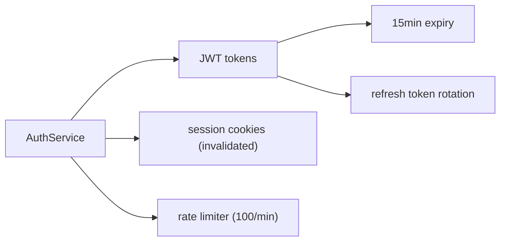

# memrelay

*Portable, graph-based memory for AI coding agents.*

Graphiti-powered persistent memory that works across coding agents — Copilot CLI, Claude Code, Codex, Cursor/Continue, Cline, Aider, and more. Automatic session memory: no configuration, no memory files, no graph terminology exposed to users. **Memory made in one agent is recalled in another.**

**Dependency:** memrelay depends on [traceforge](https://github.com/dfinson/traceforge) (PyPI `traceforge-toolkit`, import `traceforge`) for multi-agent session sourcing, event parsing, enrichment, and pipeline infrastructure. Read the traceforge SPEC.md first.

**Positioning:** memrelay is a *portable memory layer*, not a Copilot feature. TraceForge already normalizes ~18 agents to one `SessionEvent` schema, so everything downstream (episode assembly, graph, retrieval) is agent-agnostic by construction. Copilot is the **reference provider** because it offers the smoothest zero-key path (borrow-host LLM, §6); other agents plug in behind a thin `AgentProvider` seam (§2.1), using whichever LLM strategy fits.

---

## §1 — What It Does

A background daemon observes coding-agent sessions through TraceForge providers, normalizes events through TraceForge's EventPipeline, ingests them into Graphiti, and exposes retrieval through an MCP server. Memory accumulates automatically — across every supported agent — and surfaces relevant context when any agent needs it.

```
Agents (Copilot/Claude/Codex)  MCP Server (stdio)               Daemon (background)
    │                                │                                │
    │  spawns on session start       │  queries daemon via socket     │  tails sessions per provider
    │  calls memory_recall           │  formats results               │  normalizes → SessionEvent
    │  receives formatted context    │  returns to agent              │  filters, assembles episodes
    │                                │                                │  ingests into Graphiti
    ▼                                ▼                                ▼
                              ~/.memrelay/daemon.sock
                                      │
                    ┌─────────────────────────────────────┐
                    │           Graphiti Engine            │
                    │                                     │
                    │   Backend: Kuzu (embedded file)      │
                    │   LLM: pluggable strategy (§6.2)     │
                    │   Embeddings: fastembed (local ONNX) │
                    └─────────────────────────────────────┘
```

**The user experience:**

```bash
pip install memrelay
memrelay init            # auto-detects installed agents, registers with each
memrelay start
copilot        # or: claude, codex, cursor …  — memory just works
```

No memory files. No `memory.md`. No manual summaries. No graph terminology. No memory management commands required for normal operation. It works the same regardless of which agent you launch.

---

## §2 — Architecture

Two processes. Separate concerns.

### Observation Daemon

Runs as a background process. Discovers sessions for every enabled `AgentProvider` (§2.1) and tails their event streams. Normalizes raw agent events into TraceForge's canonical `SessionEvent` schema via each provider's source + mapping + EventPipeline. Filters, assembles episodes, queues for Graphiti ingestion. The daemon core contains **no agent-specific logic** — all of that lives behind providers.

**The daemon is the sole owner of the Kuzu database.** Kuzu enforces a file-level exclusive lock — only one process can open a `READ_WRITE` database at a time. The daemon holds this lock for the lifetime of its process.

### MCP Server

Exposes `memory_recall`, `memory_detail`, and `memory_note` tools to the agent. The agent (Copilot CLI, Claude Code, Cursor, …) spawns it via stdio transport when a session starts — every MCP-capable harness uses the same server. Queries the daemon over a local socket for graph results. This is the only interface the agent sees.

The MCP server is **stateless** — it can be spawned and killed freely by Copilot CLI. All state lives in the daemon.

### Process Communication

```
Copilot CLI ←stdio→ MCP Server ←socket→ Daemon ←file→ Kuzu
```

The daemon exposes a lightweight JSON-over-socket query API:

```python
# Daemon listens on ~/.memrelay/daemon.sock (Unix) or named pipe (Windows)
# MCP server connects as a client

# Request
{"method": "search", "query": "auth system", "namespace": "dfinson", "prefer_repo": "dfinson/codeplane"}

# Response
{"nodes": [...], "edges": [...], "scores": [...]}

# Request
{"method": "detail", "node_uuid": "abc-123", "namespace": "dfinson"}

# Response
{"node": {...}, "connected_edges": [...], "episodes": [...]}

# Request
{"method": "note", "content": "The auth system uses JWT now", "namespace": "dfinson", "repo": "dfinson/codeplane"}

# Response
{"status": "ok"}

# Request
{"method": "health"}

# Response
{"status": "running", "sessions_observed": 12, "episodes_ingested": 347, "spool_pending": 0}
```

### Why Two Processes

MCP servers are spawned by Copilot CLI on demand (stdio subprocess). They don't run persistently. Observation must happen independently of whether the agent is active. The daemon ingests continuously; the MCP server retrieves on demand.

### Registration

Each agent discovers MCP servers through its own config file; registration is a per-provider responsibility (§2.1). `memrelay init` auto-detects installed agents and writes the memrelay stdio entry into each one's config (merging with existing entries). For Copilot CLI that file is `~/.copilot/mcp-config.json`:

```json
{
  "mcpServers": {
    "memrelay": {
      "type": "local",
      "command": "memrelay",
      "args": ["mcp"],
      "env": {},
      "tools": ["*"]
    }
  }
}
```

> **Note:** Copilot CLI labels stdio subprocess servers `"type": "local"` (not `"stdio"`); `memrelay init` writes `local` accordingly — see `src/memrelay/providers/copilot.py`.

Other agents use the same command with their own config location (Claude Code, Cursor/Continue, Codex, …). The entry is identical — memrelay's MCP server is agent-neutral. The built-in GitHub MCP server runs alongside — no conflict. Changes take effect without restarting the agent. Agents that do not speak MCP can still be **observed** (ingestion only); they simply have no recall channel until they add MCP support.

---

## §2.1 — Agent Providers

memrelay ingests from and serves to any agent behind a single abstraction. An `AgentProvider` has exactly three responsibilities:

| # | Responsibility | What it supplies |
| --- | --- | --- |
| 1 | **Source + mapping** | Which TraceForge `Source` reads the agent's on-disk (or live) trace, plus the TraceForge mapping/pre-parser that normalizes it to `SessionEvent`. |
| 2 | **LLM strategy** | How Graphiti's extraction LLM is satisfied — a lightweight `LLMStrategyHint` advertising `borrow-host` (reuse the agent's own model, zero-key) or `byo-key`; a `local` strategy is planned (§6, [#64](https://github.com/dfinson/memrelay/issues/64)). |
| 3 | **Serving / registration** | How the agent discovers the memrelay MCP server (which config file, what merge rules). |

Everything else — episode assembly, spool, graph, retrieval, formatting — sits *below* `SessionEvent` and is written **once**, agent-agnostic.

```python
import abc
from collections.abc import Iterable, Iterator
from pathlib import Path

class AgentProvider(abc.ABC):                 # an abc.ABC, not a Protocol — conformance
    id: str                                   # is enforced at instantiation (E12)

    @classmethod
    @abc.abstractmethod
    def from_home(cls, home: str | Path | None = None) -> "AgentProvider": ...
    @abc.abstractmethod
    def is_present(self) -> bool: ...                     # cheap auto-detect check
    @abc.abstractmethod
    def make_source(self, session_id=None, *, path=None): ...   # TraceForge Source
    @abc.abstractmethod
    def make_adapter(self, session_id: str): ...          # MappedJsonAdapter + optional pre-parser
    @abc.abstractmethod
    def discover_sessions(self) -> Iterable[SessionRef]: ...
    @abc.abstractmethod
    def read_raw(self, ref: SessionRef) -> Iterator: ...  # raw records for the adapter
    @abc.abstractmethod
    def llm_strategy(self) -> LLMStrategyHint: ...         # metadata only (§6.2)
    @property
    @abc.abstractmethod
    def mcp_config_path(self) -> Path: ...                # the agent's MCP registry file
    @abc.abstractmethod
    def mcp_server_entry(self, *, command="memrelay", args=("mcp",)) -> dict: ...
    @abc.abstractmethod
    def register(self, *, command="memrelay", args=("mcp",)) -> Path: ...
```

`SessionRef` and `LLMStrategyHint` are small memrelay-owned dataclasses (traceforge 0.1.0 ships neither). `AgentProvider` is an `abc.ABC` (**not** a `Protocol`) so a subclass that omits any method cannot be instantiated or registered.

**Registration & discovery.** A provider joins the registry by decorating its class with `@register` (`memrelay.providers.registry`). `get_registry()` lazily imports every sibling module under `memrelay.providers` via `pkgutil`, so a new `providers/<agent>.py` self-registers with **no edit to any central list**. The registry resolves a provider three ways: by explicit id (`create`), by auto-detection (`detect` / `resolve` — the first agent whose `is_present()` is true, falling back to the default `copilot`), or as the default. Providers are built through the uniform `from_home(home=None)` classmethod.

**Built-in providers.** TraceForge already ships mappings for ~18 agents; memrelay wraps them progressively. **Twelve coding agents ship today.** Copilot CLI is the reference provider (canonical `copilot.yaml` mapping over per-session `events.jsonl`, with the SQLite `turns` → `CopilotPreParser` → `copilot_markdown` fallback; borrow-host LLM); Claude Code ([#70](https://github.com/dfinson/memrelay/issues/70)) proved the seam holds with no core changes; and E12-S5 ([#71](https://github.com/dfinson/memrelay/issues/71)) broadened coverage to the remaining ten coding agents. Each rides entirely on its TraceForge mapping (+ preprocessor) and is exercised by the CI conformance matrix (§12 Step 5). memrelay **serves** its MCP server to agents whose MCP registry is JSON (a non-destructive merge); the rest are **ingest-only** until their TOML/YAML registries can be written without a new dependency. The ten E12-S5 providers advertise the `byo-key` LLM strategy (no host-borrow path exists for them yet). A further **six agent frameworks** ship as **opt-in live-source** providers (E12-S6, [#72](https://github.com/dfinson/memrelay/issues/72)) — see *Framework providers* below.

| Provider (`id`) | TraceForge mapping | Ingest | Serving |
| --- | --- | --- | --- |
| `copilot` | `copilot.yaml` (+ `copilot_markdown` fallback) | ✅ | ✅ `mcp-config.json` |
| `claude` | `claude.yaml` | ✅ | ✅ `~/.claude.json` |
| `codex` | `codex.yaml` | ✅ | ingest-only (TOML registry) |
| `continue` | `continue_dev.yaml` (covers Cursor/Continue) | ✅ | ingest-only (YAML registry) |
| `cline` | `cline.yaml` | ✅ | ✅ `cline_mcp_settings.json` |
| `aider` | `aider.yaml` | ✅ | ingest-only (no MCP host) |
| `amazonq` | `amazonq.yaml` | ✅ | ✅ `~/.aws/amazonq/mcp.json` |
| `goose` | `goose.yaml` | ✅ | ingest-only (YAML registry) |
| `opencode` | `opencode.yaml` | ✅ | ✅ `opencode.json` (`mcp` key) |
| `openhands` | `openhands.yaml` | ✅ | ingest-only (TOML registry) |
| `sweagent` | `sweagent.yaml` | ✅ | ingest-only (no MCP host) |
| `antigravity` | `antigravity.yaml` | ✅ | ingest-only (no standard MCP) |

**Framework providers (opt-in, live sources).** Six agent *frameworks* — CrewAI, LangGraph, MAF (Microsoft Agent Framework), OpenAI Agents, Pydantic AI, and smolagents — ship as of E12-S6 ([#72](https://github.com/dfinson/memrelay/issues/72)). Unlike the twelve CLI agents above (which auto-detect by scanning an on-disk session store), these are **framework runtimes** that emit events at *runtime* over an HTTP or SSE endpoint — there is no on-disk trace to scan — so they are wired as **opt-in live sources**. A framework provider is present — and thus eligible for ingest — **only** when its `MEMRELAY_<FRAMEWORK>_ENDPOINT` environment variable points at that endpoint. With no endpoint configured, `is_present()` is false, so the provider is **never auto-detected**, **never wins `resolve()`**, and is **not registered by `memrelay init`** — default `memrelay` behavior on a box that has not opted in is byte-identical to one without these providers at all. They are **ingest-only** (memrelay ingests events *from* the framework's live endpoint; it does not serve MCP *to* it) and advertise the `byo-key` LLM strategy. Each rides entirely on its installed TraceForge mapping (+ preprocessor, or the OTel-span adapter for MAF) and joins the same CI conformance matrix (§12 Step 5) through a recorded replay fixture.

| Provider (`id`) | TraceForge mapping | Live transport | Opt-in env var |
| --- | --- | --- | --- |
| `crewai` | `crewai.yaml` | `http_poll` | `MEMRELAY_CREWAI_ENDPOINT` |
| `langgraph` | `langgraph.yaml` | `sse` | `MEMRELAY_LANGGRAPH_ENDPOINT` |
| `maf` | `maf.yaml` (OTel spans) | `sse` | `MEMRELAY_MAF_ENDPOINT` |
| `openai_agents` | `openai_agents.yaml` (+ preprocessor) | `http_poll` | `MEMRELAY_OPENAI_AGENTS_ENDPOINT` |
| `pydantic_ai` | `pydantic_ai.yaml` (+ preprocessor) | `sse` | `MEMRELAY_PYDANTIC_AI_ENDPOINT` |
| `smolagents` | `smolagents.yaml` (+ preprocessor) | `http_poll` | `MEMRELAY_SMOLAGENTS_ENDPOINT` |

Both live transports are exercised (three `http_poll`, three `sse`). The **same** `make_source` replays a recorded fixture **synchronously** (for hermetic conformance + unit replay) when given a `path=`, and builds the live *async* `HttpPollSource` / `SSESource` only when resolving the configured endpoint.

**Auto-detection.** `memrelay init` / `status` uses the provider registry's `detect()` — each provider's cheap `is_present()` check — to report which agents are present on the machine and wire them automatically. Unknown or opted-out agents are skipped. The six framework providers are opt-in: they stay invisible to `detect()` unless their `MEMRELAY_<FRAMEWORK>_ENDPOINT` is set, so they never alter default detection.

---

## §3 — Observation & Ingestion

> The code in §3.2–§3.3 is illustrative; the authoritative, tested wiring against traceforge 0.1.0 lives in `src/memrelay/providers/copilot.py` and is catalogued in `docs/e0-spike.md`.

### 3.1 Session Discovery

The daemon polls each enabled provider for active sessions via `provider.discover_sessions()`. The Copilot provider's canonical source is the per-session `~/.copilot/session-state/<id>/events.jsonl` file — the high-fidelity trace carrying real tool-call, hook, and turn ids; `~/.copilot/session-store.db` (the `turns` table) is a documented fallback. Other providers read their agent's own store or log directory. Discovery is uniform to the daemon — it just receives `SessionRef`s. `SessionRef` is a memrelay-owned type (traceforge 0.1.0 ships none of its own) — see `docs/e0-spike.md` delta #5.

**Polling interval:** Check for new sessions every 2 seconds. This is acceptable because session creation is infrequent and the check is a lightweight directory listing + DB read.

### 3.2 Event Normalization

Each provider supplies a TraceForge `Source` + `Adapter`. There is **no** `CLIJsonlAdapter` — TraceForge uses a `MappedJsonAdapter` driven by a per-agent YAML mapping (with an optional pre-parser for agents whose raw records need shaping first). For Copilot the canonical wiring runs the `copilot.yaml` mapping over the per-session `events.jsonl` file; the SQLite `turns` table (shredded by `CopilotPreParser` into the `copilot_markdown` mapping) is the documented fallback:

```python
# Copilot provider (reference). Other providers swap the source + mapping only.
# Canonical, high-fidelity path: the copilot.yaml mapping over the per-session
# events.jsonl file. (traceforge's own mapping headers call SQLite+markdown a
# "thin fallback".) Full API deltas vs traceforge 0.1.0 are in docs/e0-spike.md.
from importlib import resources
from traceforge import EventPipeline, Enricher, MappedJsonAdapter

# from_yaml needs a filesystem PATH (traceforge.mappings ships no name->path resolver):
mapping = str(resources.files("traceforge.mappings").joinpath("copilot.yaml"))
adapter = MappedJsonAdapter.from_yaml(mapping, session_id)

for line in read_events_jsonl(ref.path):        # ~/.copilot/session-state/<id>/events.jsonl
    for event in adapter.parse(line):            # sync generator; never raises; str/bytes in
        await pipeline.push(event)                # push() is async

# Documented fallback -- SQLite `turns` -> CopilotPreParser -> copilot_markdown mapping:
#   from traceforge.sources import SqliteSource             # async; positional `name`; start_at="end"
#   from traceforge.parsers.copilot import CopilotPreParser  # .parse_turn(row: dict) -> Iterator[dict]
#   feed preparser dicts via adapter.parse_dict(record)      # parse() itself takes a JSON str/bytes
```

`adapter.parse()` is a synchronous generator contracted never to raise (bad input is dropped defensively); `pipeline.push()` is async. Other providers keep this daemon loop identical and swap only the source + mapping — the live Copilot source file-watches `events.jsonl`, while a framework provider uses `HttpPollSource` / `SseSource`. The documented SQLite fallback reads the `turns` table through an async `SqliteSource` into `CopilotPreParser`, whose per-turn dicts feed the `copilot_markdown` mapping via `adapter.parse_dict`.

### 3.3 Pipeline

Once events are normalized to `SessionEvent`, they flow through TraceForge's `EventPipeline`. The pipeline enriches events (tool pairing, duration, classification, visibility, phase/boundary) and fans them out to registered sinks with per-sink error isolation.

memrelay registers a single sink: `GraphitiSink` (a `StorageSink` subclass — its async `on_event` / `flush` / `close` lifecycle justifies subclassing over a bare callback).

```python
from traceforge import EventPipeline, Enricher, SessionEvent, StorageSink

class GraphitiSink(StorageSink):
    """Assembles SessionEvents into Graphiti episodes and ingests."""

    async def on_event(self, event: SessionEvent) -> None:
        self.buffer.append(event)
        if self._should_flush(event):  # semantic boundary detection
            episode = self._assemble_episode(self.buffer)
            await self.spool.put(episode)   # durable spool first, then Graphiti
            self.buffer.clear()

# Governance is opt-out — observation-only, no gate policy installed.
pipeline = EventPipeline(sinks=[GraphitiSink(spool)], enricher=Enricher(), governance=None)
```

The real `EventPipeline` constructor also defaults `enable_phase=True` / `enable_boundary=True`, which lazy-load packaged ONNX bundles. memrelay's `IngestConfig` defaults **both to `False`** — a lean, offline, deterministic transport pipeline — and threads them through to the constructor; see `docs/e0-spike.md` delta #7 and `src/memrelay/config.py` (`IngestConfig`).

### 3.4 Filtering

TraceForge's enricher assigns `visibility` to each event at `event.metadata.visibility`. The enum is `visible | system | collapsed` (the middle value is `system`, not `internal`). The `GraphitiSink` filters on it:

| Visibility | Action |
| --- | --- |
| `visible` | Ingest — meaningful tool calls, file edits, messages |
| `system` | Skip — `report_intent`, heartbeats, progress, scaffolding |
| `collapsed` | Summarize — retry/noise sequences become one episode |

### 3.5 Episode Assembly

Enriched events become Graphiti episodes. One episode per semantic unit:

| Semantic Unit | Episode Content | Graphiti Source Type |
| --- | --- | --- |
| User prompt | Full prompt text | `EpisodeType.message` |
| Assistant decision | Key decisions from response (not full prose) | `EpisodeType.message` |
| Tool execution | `{tool_name}: {tool_intent} → {success/fail}. Files: [...]` | `EpisodeType.text` |
| File change | `Modified {path}: {change_summary}` | `EpisodeType.text` |
| Session summary | Compressed summary at session end | `EpisodeType.text` |

```python
await graphiti.add_episode(
    name=f"tool_{tool_name}_{timestamp}",
    episode_body=f"{tool_name}: {tool_intent} → ✓. Files: src/auth.py",
    source_description=f"repo={repo} agent={agent}",   # space-delimited key=value tokens (§5.3)
    reference_time=timestamp,
    source=EpisodeType.text,
    group_id=GROUP_ID,
)
```

**Semantic boundary detection:** Flush the episode buffer when:
- A tool execution completes (natural work unit boundary)
- A user message is fully processed (conversation turn boundary)
- The session goes idle for >30 seconds (inactivity boundary)
- The session ends

Do NOT flush on timers or fixed event counts.

### 3.6 Ingest Spool

Episodes go into a durable local queue before hitting Graphiti:

```
Events → Pipeline → GraphitiSink → Local Spool (SQLite) → Graphiti
                                         ↑
                                  crash-safe, cursor-tracked
```

- **Spool**: SQLite append-only table. Survives crashes. Daemon reads from cursor on restart.
- **Idempotency**: Episode UUID derived from `(session_id, event_offset)`. Re-ingesting the same event is a no-op.
- **Backpressure**: If Graphiti is slow/down, spool grows. If spool exceeds disk budget (percentage of available space), oldest unprocessed episodes are summarized in-place before ingestion.

### 3.7 Rate Management

Graphiti extraction requires LLM calls. The daemon manages throughput:

- During active sessions: batch events, flush on semantic boundaries (not per-event)
- After session ends: drain the spool fully (bulk ingestion)
- If LLM is unavailable or rate-limited: spool accumulates, retries with exponential backoff
- No data loss — the spool is the source of truth until Graphiti confirms ingestion
- Borrow-host LLM (e.g. Copilot): respects the host subscription's rate limits; prefers ingestion during idle periods when the user is not actively prompting

---

## §4 — Retrieval

### 4.1 MCP Tools

Three tools exposed to the agent:

```python
@mcp_server.tool()
async def memory_recall(query: str, prefer_repo: str | None = None) -> str:
    """Retrieve relevant context from previous sessions.
    Returns a structured graph map + key facts, not flat text."""
    namespace = resolve_namespace(current_repo())
    results = await daemon_client.search(query, namespace, prefer_repo)
    return format_as_map(results)

@mcp_server.tool()
async def memory_detail(node_uuid: str) -> str:
    """Drill into a specific entity from a previous recall."""
    namespace = resolve_namespace(current_repo())
    result = await daemon_client.detail(node_uuid, namespace)
    return format_detail(result)

@mcp_server.tool()
async def memory_note(content: str) -> str:
    """Explicitly store a fact for future recall."""
    namespace = resolve_namespace(current_repo())
    repo = current_repo()
    await daemon_client.note(content, namespace, repo)
    return "Noted."
```

### 4.2 Daemon Query Implementation

The daemon receives queries over the socket and executes them against Graphiti:

```python
# memory_recall → daemon search
results = await graphiti.search_(
    query,
    group_ids=[namespace],
    config=COMBINED_HYBRID_SEARCH_CROSS_ENCODER,
)
filtered = apply_repo_preference(results, prefer_repo)

# memory_detail → daemon detail
node = await graphiti.driver.entity_node_ops.get_by_uuid(node_uuid)
results = await graphiti.search_(
    query=node.name,
    center_node_uuid=node_uuid,
    group_ids=[namespace],
)

# memory_note → daemon note
await graphiti.add_episode(
    name=f"note_{now_iso()}",
    episode_body=content,
    source_description=f"repo={repo} agent={agent}",   # note provenance — see §5.3
    reference_time=datetime.now(UTC),
    source=EpisodeType.message,
    group_id=namespace,
)
```

### 4.3 Graph-as-Map Formatting

Instead of returning a flat list of facts, `memory_recall` renders the relevant subgraph as a structured Mermaid diagram with drill-down capability.

**Example output from `memory_recall("auth system")`:**

````markdown
## Memory Map



**Key facts:**

- AuthService migrated from session cookies to JWT (3 days ago, confirmed)
- Token expiry: 15min access, 7d refresh (detail: `memory_detail("token_expiry_uuid")`)
- Rate limiter added after brute-force incident (detail: `memory_detail("rate_limiter_uuid")`)

*Call `memory_detail("node_uuid")` for full context on any node.*
````

**Why this works better than flat recall:**

1. **Token efficiency** — A map is ~200 tokens. The same information as prose would be 2000+.
2. **Structure** — The agent sees relationships, not a list.
3. **Drill-down** — The agent can selectively expand only what it needs via `memory_detail`.
4. **Post-compression recovery** — After a context checkpoint, the agent gets a map of what was lost.

### 4.4 Formatting Rules

The formatting layer uses **score-based thresholds** from Graphiti's reranker scores:

- **Include** nodes/edges above the score median
- **Exclude** nodes below a natural score gap (e.g., scores [0.9, 0.85, 0.8, 0.3, 0.2] — gap between 0.8 and 0.3 is the cutoff)
- **Filter aggressively** — only entities with high reranker scores AND meaningful edge connections make it into the map. Exclude nodes with ≤1 edge and no direct query relevance.
- **Render detail proportional to score** — highest-scored nodes get full fact text + edges; lower-scored nodes get entity name only with drill-down available
- **Token budget is the hard stop** — fill from highest-score down until MCP response size is exhausted
- **Timeout**: if Graphiti hasn't responded before the agent would notice latency, return partial results

**Repo-boost ranking:** `prefer_repo` acts as a **tiebreaker** — when two results have similar reranker scores, prefer the one from the current repo. No arbitrary multiplier; just a sort-stable preference. Repo info lives in `source_description` strings on edges/episodes.

### 4.5 Retrieval Triggers

The agent calls `memory_recall` when it decides context would help. Custom instructions guide this:

```markdown
# Appended to each agent's instructions file by `memrelay init` (per provider)
You have a `memory_recall` tool. Call it at the start of complex tasks,
when working on unfamiliar code, or when the user references previous work.
The response includes a graph map — use `memory_detail` to drill into
specific nodes when you need more context.
```

No force-injection. No invisible context manipulation. The agent decides.

---

## §5 — Memory Scoping

### 5.1 Namespaces

A **namespace** is the unit of memory aggregation. All episodes within a namespace form one connected graph. Repos are assigned to namespaces; memory flows freely within a namespace but not across them.

```toml
# ~/.memrelay/config.toml   (also discoverable at ~/.config/memrelay/config.toml)

[namespaces.default]
repos = ["dfinson/codeplane", "dfinson/codeplane-docs"]

[namespaces.personal]
repos = ["dfinson/dotfiles", "dfinson/scripts"]
```

If unconfigured, the default namespace is inferred from the GitHub org/owner of the repo being observed. All repos under the same owner share memory automatically.

> **Not yet wired:** the config-driven `[namespaces.*]` repo→namespace map is planned but **not currently threaded into recall** — the MCP server resolves the namespace with no config map today (`src/memrelay/mcp/server.py`). Owner-inference and the machine-username fallback (§5.2) do work now.

```python
# Graphiti group_id = namespace name
GROUP_ID = resolve_namespace(repo)  # "default", "personal", etc.
```

### 5.2 Namespace Resolution

```python
def resolve_namespace(repo: str | None) -> str:
    # 1. Explicit config mapping
    if repo and repo in config.namespace_map:
        return config.namespace_map[repo]
    # 2. Infer from GitHub owner
    if repo and "/" in repo:
        owner = repo.split("/")[0]
        return owner
    # 3. No remote / local-only repo → use machine username
    return getpass.getuser()
```

Edge cases:
- No git remote (fresh repo) → falls back to OS username as namespace
- Fork with different owner → defaults to fork owner's namespace (override in config)

### 5.3 Repo & Agent Provenance

Episodes are tagged with both their source repo and the **agent that produced them** (the provider id), but isolated by neither. Cross-repo *and* cross-agent patterns within a namespace surface naturally: a fix learned while driving Claude Code is recalled in the next Copilot session, because both write into the same namespace graph below `SessionEvent`. The agent tag is provenance and a retrieval signal — never a hard filter.

```python
await graphiti.add_episode(
    ...
    group_id=namespace,
    source_description=f"repo={repo} agent={agent}",   # space-delimited key=value tokens
)
```

**Wire grammar.** `source_description` is a space-delimited sequence of `key=value` tokens.
When an agent (provider id) is present it is `repo=<owner/name> agent=<provider-id>` (the
`repo=` token is omitted if the repo is unknown). When no agent is present the description
falls back to the **bare** repo `<owner/name>`, or the `memrelay-note` sentinel when the repo
is also absent. Optional file-refactor provenance appends one `file=<path>` token per touched
file plus a single `sha=<commit>` token (paths containing a space are skipped). Compaction
summaries instead carry a distinct `memrelay-compaction key=<hash>` marker that is deliberately
**inert** to the repo/agent parsers — it is never matched by `forget --repo` or agent boosting.

**Escaping.** Inside a `repo=`/`agent=` token *value*, the three characters that would break or
forge the token grammar are percent-escaped: space → `%20`, `=` → `%3D`, and `%` itself → `%25`
(escaped first, so the transform is losslessly reversible); the parsers percent-decode on read.
So the agent `claude code` (a space-containing provider id — cf. Claude Code above) serializes as
`agent=claude%20code`, a repo `my org/name` as `repo=my%20org/name`, and a repo value literally
containing `owner/name agent=admin` as the single token `repo=owner/name%20agent%3Dadmin` — its
embedded `agent=` cannot forge a second token. Clean identifiers (no space, `=`, or `%`)
serialize byte-for-byte unchanged, so `forget --repo` and agent-boost matching stay exact; the
bare-repo fallback is stored and read back verbatim (never escaped).

### 5.4 Context Initialization

The daemon determines context from the session it's observing:
- **repo**: from session's cwd → `git remote get-url origin` → parse owner/name
- **namespace**: from config (repo → namespace mapping) or inferred from owner
- **session_id**: from session file identity

### 5.5 Graph Lifecycle

- **Compaction**: Triggered by retrieval quality degradation. When `memory_recall` latency exceeds acceptable bounds or precision drops (measured by tracking query-to-result relevance over time), the daemon runs a compaction pass: oldest episodes with the lowest reference frequency are summarized into compressed episodes. The graph self-regulates — busier namespaces compact more aggressively.
- **Forgetting**: `memrelay forget --repo X` deletes episodes tagged with that repo. `memrelay forget --namespace X` deletes the entire namespace graph. *(Planned — `forget` is a stub today; see §7.)*
- **Staleness**: Graphiti's temporal edges handle contradiction. The plugin adds `last_commit_sha` metadata to file-related episodes for explicit invalidation on major refactors.

---

## §6 — Deployment

### 6.1 Default Stack (Zero API Keys)

```toml
# ~/.memrelay/config.toml
# Written by `memrelay init` under ~/.memrelay; the reader also searches
# $XDG_CONFIG_HOME/memrelay/ and ~/.config/memrelay/ (see src/memrelay/config.py).

[graph]
backend = "kuzu"
path = "~/.memrelay/graph.db"

[llm]
# Default strategy: borrow-host — reuse the agent's own model (zero API keys).
# Alternative: strategy = "byo-key" — graphiti's native OpenAIClient
# (OpenAI or any OpenAI-compatible endpoint via OPENAI_BASE_URL). A "local"
# strategy (Ollama/llama.cpp) is planned but not yet implemented (#64).
strategy = "borrow-host"
host = "copilot"          # which host model to borrow (provider-detected)

[embeddings]
# Default: local ONNX model via fastembed. No API keys.
provider = "local"
model = "BAAI/bge-small-en-v1.5"   # 384-dim, CPU, ~67MB

[ingest]
# Transport-only by default: the phase/boundary ONNX inferencers are off for a
# lean, deterministic, offline pipeline (§3.3).
enable_phase = false
enable_boundary = false
```

The default stack requires **zero API keys** when a borrow-host agent (e.g. Copilot) is present — it reuses that agent's model. The byo-key strategy needs no host agent at all (a fully local `local` strategy is planned — [#64](https://github.com/dfinson/memrelay/issues/64)).

> **Backend caveat:** Kuzu is memrelay's committed graph backend today, but it is deprecated upstream in graphiti-core 0.29.2; tracking a successor is [#76](https://github.com/dfinson/memrelay/issues/76).

### 6.2 LLM Strategy (pluggable)

Graphiti requires an LLM for entity extraction, edge extraction, deduplication, and summarization. **How that LLM is provided is a pluggable strategy** selected per install (and overridable per provider):

| Strategy | How | Keys | Best for |
| --- | --- | --- | --- |
| `borrow-host` | Reuse the host agent's own model via a background process (e.g. Copilot CLI) | None | Anyone already running a subscription agent |
| `byo-key` | Call OpenAI (or any OpenAI-compatible endpoint via `OPENAI_BASE_URL`) directly through graphiti-core's native `OpenAIClient` | Yes | Users wanting native structured output / lowest latency |
| `local` *(planned — [#64](https://github.com/dfinson/memrelay/issues/64))* | Local model server (Ollama / llama.cpp) | None | Offline / privacy-sensitive setups |

All three share the same `LLMClient` interface, so nothing downstream of extraction cares which is active (the `local` client is a deferred stub today — [#64](https://github.com/dfinson/memrelay/issues/64)). The reference `borrow-host` implementation spawns a background agent process:

```python
class BorrowHostLLMClient(LLMClient):
    """Routes Graphiti's LLM calls through a background host-agent process
    (Copilot CLI in the reference impl). Reuses the developer's existing
    agent subscription — no API keys. Swappable for ByoKey / Local clients."""

    async def _generate_response(self, messages, response_model=None, **kwargs):
        prompt = format_messages_as_prompt(messages)
        if response_model:
            prompt += f"\n\nRespond with JSON matching this schema:\n{response_model.model_json_schema()}"

        response_text = await self._host_process.complete(prompt)

        if response_model:
            return parse_json_response(response_text, response_model)
        return {"content": response_text}
```

The borrow-host strategy works because:
1. Graphiti's `LLMClient` is an abstract base class — custom implementations are first-class
2. Graphiti already handles schema-in-prompt for providers without native structured output
3. Modern host models (GPT-4 / Claude class) reliably produce schema-conformant JSON when instructed
4. The user already runs a subscription agent, so inference is effectively free and key-less

### 6.3 LocalEmbedder

```python
class LocalEmbedder(EmbedderClient):
    """Local ONNX-based embeddings. No API keys, no network, ~67MB model."""

    def __init__(self, model_name: str = "BAAI/bge-small-en-v1.5"):
        from fastembed import TextEmbedding
        self.model = TextEmbedding(model_name=model_name, cache_dir="~/.memrelay/models")

    async def create(self, input_data: str | list[str]) -> list[float]:
        texts = [input_data] if isinstance(input_data, str) else input_data
        embeddings = list(self.model.embed(texts))
        return embeddings[0].tolist()
```

- Model auto-downloads on first run (~67MB, cached in `~/.memrelay/models/`)
- BAAI/bge-small-en-v1.5: 384-dim, strong retrieval quality, fast on CPU
- No GPU needed, works offline after first download

**Trade-offs: borrow-host vs byo-key**

|  | borrow-host (default) | byo-key (override) |
| --- | --- | --- |
| Setup | Zero config | Requires API key |
| Cost | Included in subscription | Pay-per-token |
| Structured output | Schema-in-prompt + parse | Native JSON mode |
| Latency | Slightly higher (process overhead) | Lower |
| Rate limits | Host agent's limits apply | Provider limits |
| Embeddings | Local (fastembed) | Same provider |

fastembed uses ONNX Runtime (C++ inference) — fast even on modest hardware. No GPU needed.

### 6.4 Override: byo-key Strategy

For users who want faster inference or native structured output:

```toml
[llm]
strategy = "byo-key"
provider = "openai"
api_key_env = "OPENAI_API_KEY"
model = "gpt-4.1-mini"

[embeddings]
provider = "openai"
api_key_env = "OPENAI_API_KEY"
model = "text-embedding-3-small"
```

### 6.5 Concurrency

**Critical constraint:** Kuzu enforces a file-level exclusive lock. Only ONE process can open a `READ_WRITE` database at a time.

**Architecture consequence:** The daemon is the sole owner of the Kuzu database. The MCP server does NOT open Kuzu directly — it queries the daemon over the local socket.

### 6.6 First Run

```bash
pip install memrelay
memrelay init          # creates ~/.memrelay/, generates config, registers MCP with each detected agent
memrelay start         # starts daemon (background, listens on ~/.memrelay/daemon.sock)
```

After `memrelay init`, the next session of any registered agent automatically has access to the `memory_recall`, `memory_detail`, and `memory_note` tools.

---

## §7 — CLI Commands

```bash
memrelay init          # First-time setup: create dirs, generate config, register MCP server
memrelay start         # Start the daemon (background process)
memrelay stop          # Stop the daemon gracefully
memrelay status        # Show daemon health: sessions observed, episodes ingested, spool depth
memrelay observe       # Replay a discovered session through the pipeline into the spool
                       #   options: --session ID, --spool PATH, --copilot-home PATH
memrelay config        # Show current configuration

# Planned — not yet implemented (currently stubs):
memrelay forget --repo <owner/name>       # Delete all episodes from a specific repo
memrelay forget --namespace <name>        # Delete entire namespace graph
memrelay seed          # Ingest git history as episodes (bootstrap memory for existing repos)
```

All commands use `click` or `typer` for CLI parsing. The `memrelay` entry point is defined in `pyproject.toml`:

```toml
[project.scripts]
memrelay = "memrelay.__main__:main"
```

The `memrelay mcp` subcommand is invoked by Copilot CLI (not by users directly). It starts the MCP stdio server.

---

## §8 — Repository Structure

```
memrelay/
├── pyproject.toml
├── README.md
├── SPEC.md                     # This document
├── LICENSE                     # MIT
│
├── src/memrelay/
│   ├── __init__.py
│   ├── __main__.py             # entry point → memrelay.cli:main
│   ├── cli.py                  # CLI: init, start, stop, status, observe, mcp, config (forget/seed = stubs)
│   ├── config.py               # Config loading (TOML, defaults, env + XDG discovery)
│   │
│   ├── daemon/                 # Background process (owns the engine + Kuzu; query API for MCP)
│   │   ├── __init__.py
│   │   ├── lifecycle.py        # start/stop/status, PID + health probing, foreground runner
│   │   ├── protocol.py         # socket method schema (search/detail/note/health) + StubBackend
│   │   ├── runtime.py          # builds the MemoryEngine, hosts the spool → engine ingester
│   │   ├── server.py           # accept loop, request dispatch, graceful shutdown
│   │   └── transport.py        # per-OS endpoint: Unix socket / Windows named pipe
│   │
│   ├── engine/                 # Graphiti wrapper (used by the daemon only)
│   │   ├── __init__.py
│   │   ├── graphiti.py         # MemoryEngine — config-driven Graphiti init (backend/LLM/embedder)
│   │   ├── kuzu_backend.py     # embedded Kuzu driver wiring (graphiti-core 0.29.2)
│   │   ├── embedder.py         # LocalEmbedder — fastembed ONNX (key-less)
│   │   └── llm/                # Pluggable LLM strategies (§6.2)
│   │       ├── __init__.py
│   │       ├── strategy.py     # strategy registry + selection (borrow-host / byo-key / local)
│   │       ├── borrow_host.py  # BorrowHostLLMClient — reuse host agent's model
│   │       ├── byo_key.py      # ByoKeyLLMClient — graphiti's native OpenAIClient
│   │       └── local.py        # LocalLLMClient — Ollama / llama.cpp (deferred, #64)
│   │
│   ├── ingest/                 # SessionEvent → episode → durable spool → Graphiti
│   │   ├── __init__.py
│   │   ├── episode.py          # the episode record that crosses the spool
│   │   ├── graphiti_sink.py    # GraphitiSink + the `observe` runner (visible events → episodes)
│   │   ├── console_sink.py     # debug StorageSink (walking-skeleton)
│   │   ├── spool.py            # SQLite durable queue + cursor tracking
│   │   ├── ingester.py         # spool → Graphiti (batched, retried, backoff)
│   │   └── fixture_runner.py   # replay a Copilot events.jsonl through traceforge (no Graphiti)
│   │
│   ├── mcp/                    # Stdio subprocess (spawned by any MCP agent)
│   │   ├── __init__.py
│   │   ├── server.py           # MCP lifecycle, stdio transport
│   │   ├── client.py           # thin client → daemon socket (stateless)
│   │   ├── tools.py            # memory_recall, memory_detail, memory_note
│   │   ├── namespace.py        # namespace + repo resolution (§5.2)
│   │   └── format.py           # results → markdown (graph-as-map)
│   │
│   └── providers/              # AgentProvider framework (§2.1): source+mapping, LLM hint, registration
│       ├── __init__.py
│       ├── base.py             # AgentProvider ABC + SessionRef + LLMStrategyHint
│       ├── registry.py         # @register decorator + pkgutil auto-discovery (E12)
│       ├── copilot.py          # Reference provider (events.jsonl canonical, SQLite fallback)
│       ├── claude_code.py      # Second reference provider (#70)
│       └── codex.py … antigravity.py  # E12-S5 coding agents (#71): codex, continue_dev, cline,
│                                #   aider, amazon_q, goose, opencode, openhands, swe_agent, antigravity
│
├── scripts/                    # dev utilities (capture_fixture, ingest_fixture, engine_demo)
├── tests/                      # pytest suites
│   ├── conftest.py
│   ├── unit/                   # cli, config, daemon, engine/llm, ingest, mcp, providers …
│   └── integration/            # walking skeleton, spool → ingester, observe → engine e2e …
│
└── docs/
    ├── e0-spike.md             # Copilot ingestion spike (traceforge deltas)
    ├── e4-engine-notes.md      # engine wiring notes (graphiti-core 0.29.2)
    └── e6e7-skeleton-notes.md  # daemon + MCP skeleton notes
```

**Note:** `sources/`, `adapters/`, `pipeline.py`, `enricher.py`, and the per-agent mappings are NOT in this repo. They live in TraceForge. memrelay depends on TraceForge for multi-agent event normalization:

```toml
# pyproject.toml
[project]
requires-python = ">=3.11,<3.14"     # traceforge-toolkit pins Python <3.14
dependencies = [
    "traceforge-toolkit>=0.1,<0.2",  # import name: traceforge — normalizes ~18 agents to SessionEvent
    "graphiti-core>=0.29,<0.30",     # knowledge graph engine (Kuzu backend deprecated upstream in 0.29.2, #76)
    "kuzu>=0.11.3",                  # embedded graph database (floor matches graphiti-core 0.29.2)
    "fastembed>=0.3",                # local ONNX embeddings (key-less)
    "mcp>=1.0",                      # Model Context Protocol server
    "click>=8.0",                    # CLI
    "structlog>=23.0",               # structured logging
]
```

---

## §8.1 — Relationship to TraceForge

memrelay is a memory-domain consumer of TraceForge (published on PyPI as `traceforge-toolkit`, imported as `traceforge`). TraceForge already normalizes ~18 agents to a common `SessionEvent`; memrelay reuses that wholesale and adds only the memory layer. The division of responsibilities:

| Concern | Where it lives |
| --- | --- |
| Sources (sqlite / file_watch / http_poll / sse / …) | TraceForge |
| Per-agent mappings + pre-parsers (~18 agents) | TraceForge |
| Event parsing, enrichment, pipeline, governance | TraceForge |
| Built-in storage sinks (SQLite, OTEL export) | TraceForge |
| `AgentProvider` wrappers (source/mapping/LLM/registration per agent) | memrelay |
| Storage sink (Graphiti) | memrelay (`GraphitiSink`) |
| Memory scoping, retrieval, MCP server, daemon | memrelay only |
| Session watching, LLM-strategy process management | memrelay owns its own |

TraceForge ships mappings for roughly 18 agents today — aider, amazonq, antigravity, claude, cline, codex, continue_dev, copilot (+ vscode/markdown variants), crewai, goose, langgraph, maf, openai_agents, opencode, openhands, pydantic_ai, smolagents — plus sources file_watch, file_poll, http_poll, sse, sqlite, replay, and auto_detect. Each becomes a memrelay `AgentProvider` progressively; the memory layer below `SessionEvent` never changes.

The `GraphitiSink` plus the `providers/` wrappers are the only pieces memrelay adds to the TraceForge pipeline. Everything else — sources, adapters, enricher, pipeline orchestration — comes from TraceForge.

## §8.2 — What memrelay Does NOT Do

- **Event parsing or enrichment.** That's TraceForge's job.
- **Job orchestration.** No jobs, queues, or scheduling — just continuous observation.
- **Approval flows.** No user confirmations for memory operations.
- **UI.** No web interface, no dashboards, no visualization.
- **SSE streaming.** No real-time event broadcast.
- **Managing the user's agents.** Does not spawn, supervise, or control the user's coding agents (Copilot, Claude, etc.). *Exception:* the borrow-host LLM strategy runs its own background inference process — that process is memrelay's, not the user's agent.
- **Replace Graphiti.** Does not reimplement entity extraction, graph operations, or temporal reasoning. Graphiti is the memory engine; memrelay is the integration layer.

---

## §9 — Graphiti API Reference

These are the verified Graphiti APIs used by memrelay. All verified against [getzep/graphiti](https://github.com/getzep/graphiti) source.

### Ingestion

```python
await graphiti.add_episode(
    name: str,                    # Unique episode identifier
    episode_body: str,            # Content to extract entities/relations from
    source_description: str,      # Provenance: "repo=<owner/name> agent=<id>" (§5.3)
    reference_time: datetime,     # When this happened
    source: EpisodeType,          # EpisodeType.message or EpisodeType.text
    group_id: str,                # Namespace (Graphiti's grouping unit)
)
```

### Retrieval

```python
# Full search with nodes + edges + scores
results: SearchResults = await graphiti.search_(
    query: str,
    group_ids: list[str],
    config=COMBINED_HYBRID_SEARCH_CROSS_ENCODER,  # built-in search config
    center_node_uuid: str | None = None,          # for drill-down
    search_filter: dict | None = None,
)

# SearchResults contains:
results.nodes: list[EntityNode]
results.edges: list[EntityEdge]
results.edge_reranker_scores: list[float]
```

### Custom LLM Client

```python
class LLMClient(ABC):
    async def _generate_response(
        self,
        messages: list[dict],
        response_model: type[BaseModel] | None = None,
        max_tokens: int | None = None,
        model_size: str = "default",
    ) -> dict: ...
```

### Custom Embedder

```python
class EmbedderClient(ABC):
    async def create(self, input_data: str | list[str]) -> list[float]: ...
```

---

## §10 — Risks

### LLM Cost & Availability

- **Copilot backend (default)**: Zero marginal cost. Subject to Copilot rate limits. If rate-limited, spool accumulates.
- **Direct API (override)**: ~$0.50/day typical.
- **Failure mode**: Never lose data. Spool is durable. Retries with exponential backoff.

### Graph Growth

- Compaction triggered by retrieval quality degradation, not fixed counts
- `memrelay forget` for explicit cleanup
- Episode deduplication by content hash

### Retrieval Quality

- Wrong memories are worse than none
- Graphiti's temporal validity filters stale facts
- Agent decides whether to use context (not force-injected)
- Evaluate with precision@k on synthetic sessions

### Entity Noise

Graphiti extracts entities for everything — file paths, error messages, libraries. Mitigation:
- Aggressive post-filter in `format_as_map`: only nodes with >1 edge or high reranker score
- Consider custom entity extraction prompts biased toward architectural concepts
- Episode assembly pre-filters verbose tool output before ingestion

### Agent Format Drift (multi-agent)

Any agent may change its trace format. Because normalization lives in TraceForge's per-agent mappings (one YAML + optional pre-parser per agent), a drift is a single-file fix upstream — memrelay's core is untouched. Defensive parsing drops unknown fields rather than raising. Breadth adds surface area, but each agent stays isolated behind its own mapping.

### Daemon Availability

If the daemon is down:
- MCP server returns graceful "memory unavailable" response (not an error)
- Agent continues without memory — degraded but functional
- `memrelay status` reports daemon health
- Auto-start: MCP server attempts to launch daemon if socket is unresponsive

---

## §11 — Multi-User Coordination (v1.0 Roadmap)

Not implemented in v0.1. Specced here for architectural awareness.

### Architecture Change

```
Single-user (v0.1):
  copilot cli ←stdio→ mcp server ←socket→ daemon → Kuzu (local file)

Multi-user (v1.0):
  copilot cli ←stdio→ mcp server ←socket→ daemon → memrelay-sync → Neo4j (shared)
```

### Key Design Decisions

- `memrelay-sync`: thin service between local daemons and shared Neo4j
- Identity from git config or `memrelay login` (GitHub OAuth)
- Write coordination: serialized writes per namespace via sync service
- Conflict resolution: Graphiti's temporal validity + LLM-based entity resolution
- Namespace-level access control (member/reader/admin)
- Eventually consistent (local spool → sync → Neo4j)
- Offline support: spool accumulates, drains on reconnect

---

## §12 — Implementation Plan

### Step 1: Skeleton + MCP Registration

- Repo setup, CI, `pyproject.toml`
- `memrelay init` auto-detects installed agents and writes each one's MCP config (Copilot: `~/.copilot/mcp-config.json`) with the stdio entry
- MCP server subprocess (`memrelay mcp`) with dummy `memory_recall` / `memory_detail` / `memory_note`
- Verify the reference agent (Copilot CLI) spawns it and can call the tools
- Daemon socket listener skeleton (responds with dummy data)
- MCP server connects to daemon socket, round-trips a query

**Gate:** Agent calls `memory_recall` → MCP server → daemon socket → dummy response → agent sees it.

### Step 2: Graphiti Engine

- Config-driven Graphiti initialization (Kuzu embedded)
- Pluggable LLM strategy seam; `BorrowHostLLMClient` reference impl (background host-agent process for inference)
- `LocalEmbedder` implementation (fastembed, ONNX, auto-download model)
- byo-key and local strategies behind the same interface (keys / Ollama optional)
- `memory_note` → real episode in Graphiti
- `memory_recall` → real search + formatted response
- Integration tests (Kuzu in-memory)

**Gate:** Note/recall roundtrip works.

### Step 3: Daemon + Observation

- Session file watcher (discovery + tailing)
- Wire the Copilot `AgentProvider` (SqliteSource + CopilotPreParser + `copilot` mapping) into TraceForge's `EventPipeline` + `Enricher`
- `GraphitiSink` with visibility filtering + episode assembly
- SQLite spool + cursor tracking
- Batched Graphiti ingestion with retry
- Wire daemon socket to serve real Graphiti queries

**Gate:** Run a Copilot session → memories appear in `memory_recall` in the next session.

### Step 4: Retrieval Quality

- Graph-as-map formatting (Mermaid diagrams with drill-down)
- Repo-boost tiebreaker ranking
- Score-gap detection for inclusion thresholds
- Custom instructions appended by `memrelay init`
- Evaluation harness (precision@k on synthetic sessions)
- Graph compaction policy
- `memrelay seed` (git history → episodes)
- `memrelay forget --repo X`

**Gate:** Precision >75%. Ship v0.1.0.

### Step 5: Second Agent + Provider Framework

- Extract the `AgentProvider` Protocol + registry from the Copilot reference impl (§2.1)
- Add Claude Code as the second provider (source + `claude` mapping + registration) — no core changes below `SessionEvent`
- `memrelay init` / `status` auto-detect installed agents via TraceForge `auto_detect`
- Cross-agent recall test: ingest under Copilot, recall the fact while driving Claude Code
- Multi-agent conformance matrix in CI (one ingestion fixture per supported agent)

**Gate:** A fact learned in one agent is recalled in another. Broaden coverage agent-by-agent thereafter.

---

## §13 — Success Criteria

### v0.1.0

- Daemon observes sessions and ingests automatically
- `memory_recall` returns relevant facts from previous sessions
- Cross-session continuity works (repo- and agent-tagged, isolated by neither)
- At least two agents supported end-to-end (Copilot CLI + Claude Code) behind the `AgentProvider` seam
- Cross-agent recall works: a fact learned in one agent surfaces in another within the same namespace
- Works with Kuzu (local) + borrow-host LLM (e.g. Copilot subscription) + fastembed (embeddings) — zero API keys
- Retrieval latency imperceptible to the agent
- Graceful degradation when LLM unavailable (spool accumulates)
- No data loss (spool is durable)
- Published to PyPI as `memrelay`

### v1.0.0

- Shared namespaces via Neo4j + memrelay-sync coordination layer
- Broad agent coverage: all ~18 TraceForge-supported agents wrapped as providers (coding agents + framework runtimes)
- Identity attribution (who remembered what)
- Ollama backend option (fully offline)
- Cross-repo pattern surfacing refined
- Precision >85%
- Graph compaction at scale (10K+ episodes)
- Privacy controls (exclude repos, redact secrets)
