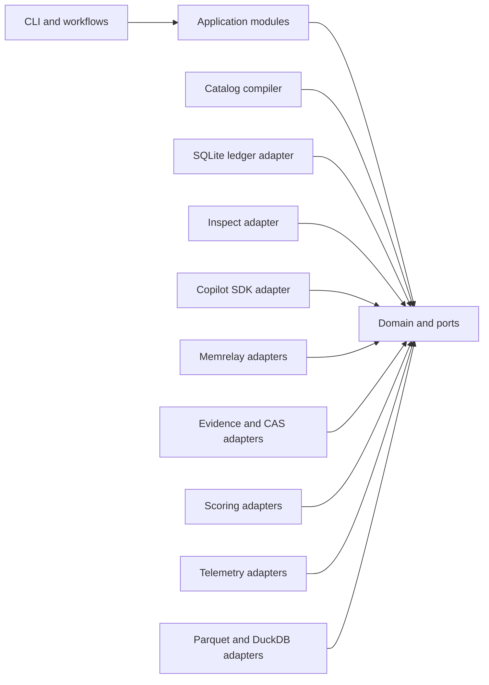
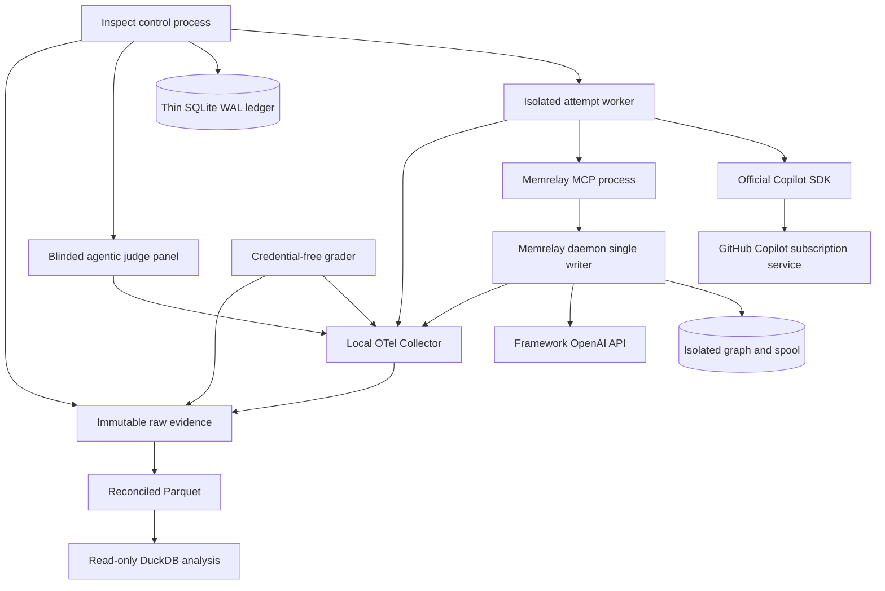

# Architecture Spine - memrelay Evaluation Platform

## Design Paradigm

The evaluator is a Hexagonal Modular Monolith with an Append-Only Run Ledger.

Domain policy and ports live at the center. Catalog, orchestration, evidence, scoring, and analysis are application modules. Inspect AI, GitHub Copilot SDK, memrelay, OpenTelemetry, filesystems, SQLite, Parquet, and DuckDB are adapters. External SDK types do not enter the domain.

Inspect owns execution truth. The ledger owns durable experiment identity and lifecycle truth. Immutable artifacts own evidence. Parquet owns reconciled analysis tables. DuckDB is read-only over those tables.



## Invariants and Rules

### AD-01 - Hexagonal modular monolith [ADOPTED]

- **Binds:** all evaluator packages and integrations
- **Prevents:** framework SDK churn, circular dependencies, and external types entering causal policy
- **Rule:** Domain code depends only on the Python standard library and domain-owned types. Application modules depend inward on domain ports. External libraries are imported only by adapters, CLI composition, or generated integration code.

### AD-02 - Separate evaluation project boundary [ADOPTED]

- **Binds:** packaging, dependencies, tests, artifacts, and CI
- **Prevents:** evaluator dependencies entering the shipped memrelay wheel or runtime
- **Rule:** The evaluator lives under `evaluation/` with its own `pyproject.toml`, `uv.lock`, CLI, schemas, tests, and artifact root. It may import local memrelay source for the direct-engine stratum but is excluded from product packaging and default dependencies.

### AD-03 - Separate product and engine strata [ADOPTED]

- **Binds:** treatment assignment, estimands, claims, costs, and reports
- **Prevents:** transport overhead being mistaken for engine behavior and upper-bound results being presented as product efficacy
- **Rule:** Shipped daemon plus MCP is the agent-facing product stratum. Direct `MemoryEngine` is the engine upper-bound stratum. Each has distinct protocol IDs, assignments, estimands, cost ledgers, intervals, evidence, and claim IDs. Results are never pooled.

### AD-04 - Inspect execution truth and thin ledger [ADOPTED]

- **Binds:** run execution, exports, lifecycle, and audit
- **Prevents:** duplicated event stores and disagreement about what executed
- **Rule:** Inspect AI is the execution authority. Preserve native `.eval` logs and Inspect native JSON exports. The native Copilot SDK terminal record is mandatory corroborating evidence, not a competing authority. Any terminal-status disagreement blocks reconciliation and excludes the run from analysis. The ledger records only identity, assignment, lifecycle transitions, artifact hashes, attempt links, and terminal inclusion status. It never copies Inspect events.

### AD-05 - Append-only evidence architecture [ADOPTED]

- **Binds:** ledger, artifacts, analysis, retries, and deletion
- **Prevents:** overwritten attempts, mutable evidence, and DuckDB becoming operational state
- **Rule:** SQLite WAL stores append-only ledger events and the Inspect control process is its sole writer. Workers emit transition intents to the control process and never open the ledger database. Large immutable artifacts use stdlib SHA-256 filesystem content addressing. Reconciled terminal evidence materializes versioned Parquet tables. DuckDB opens Parquet read-only.

### AD-06 - Host-native isolated execution [ADOPTED]

- **Binds:** primary Copilot trials and attempt provisioning
- **Prevents:** credential loss, cross-arm contamination, and shared mutable trial state
- **Rule:** Every attempt gets a fresh workspace, `MEMRELAY_HOME`, graph, spool, socket or port, cache roots, agent session root, and worker process. Workers are never reused across arms or attempts. Containers may run Copilot-credential-free framework, engine, deterministic-grader, and fault tests, but not subscription-authenticated task-agent or agentic-judge workers.

### AD-07 - Immutable and dynamic history protocols [ADOPTED]

- **Binds:** controlled efficacy, longitudinal trials, assignment, and analysis
- **Prevents:** post-treatment history contamination and invalid pooling
- **Rule:** Controlled trials restore the same immutable hash-addressed history before assignment exposure. Dynamic trials assign the whole sequence before history generation and allow assigned writes to affect later episodes. Protocol IDs and estimands remain separate and are never pooled.

### AD-08 - One worker per run attempt [ADOPTED]

- **Binds:** orchestration, concurrency, cleanup, and retries
- **Prevents:** leaked state and concurrency-dependent treatment contamination
- **Rule:** Inspect runs in the control process and launches one isolated worker process per attempt through a bounded local concurrency pool. Cleanup is recorded compensating work, not rollback of evidence.

### AD-09 - Credential separation by process [ADOPTED]

- **Binds:** Copilot task agents, agentic judges, memrelay framework calls, deterministic graders, analysis, telemetry, and evidence
- **Prevents:** OpenAI credentials entering the agent path and GitHub credentials entering framework processes
- **Rule:** Task-agent and agentic-judge workers receive only host Copilot authentication and no OpenAI key or base URL, but run in separate fresh sessions with separate roles, prompts, artifacts, and telemetry identities. The memrelay framework process receives only its configured OpenAI credential and no GitHub token. Deterministic graders, analysis, Collector, and evidence processes receive neither.

### AD-10 - Compiled scenario catalog [ADOPTED]

- **Binds:** scenarios, Inspect tasks, fixtures, assignments, traceability, and CI
- **Prevents:** ad hoc production tasks and drift from the TEA design source
- **Rule:** Versioned YAML is the human-authored source. A deterministic compiler validates it against pinned JSON Schema 2020-12 and emits RFC 8785 canonical JSON, Inspect task definitions, opaque assignment inputs, fixture manifests, and traceability maps. One shared canonicalizer supplies identity bytes to every compiler, ledger, evidence, and analysis unit. Generated outputs are never hand-edited. The current TEA Markdown scenario table is a design source, not an executable catalog.

### AD-11 - Stable opaque identity and append-only lifecycle [ADOPTED]

- **Binds:** experiment, protocol, scenario, task, history, assignment, run, attempt, artifact, evidence, endpoint, and claim IDs
- **Prevents:** treatment disclosure through IDs, record replacement, and ambiguous lineage
- **Rule:** IDs never encode treatment labels. Mutable revisions receive new content hashes. The listed lifecycle belongs to the run: `planned`, `assigned`, `provisioned`, `running`, `exported`, `scored`, `reconciled`, then `included` or `excluded`. Each attempt has a separate immutable terminal classification, including success, timeout, agent/provider/grader failure, evidence failure, cancellation, and pre- or post-exposure infrastructure failure. Failed attempts attach to their run without inventing run transitions. Retries create linked attempt IDs and retain every prior attempt.

### AD-12 - Concealed treatment assignment [ADOPTED]

- **Binds:** provisioning, agents, graders, adjudicators, exports, and reports
- **Prevents:** treatment-aware behavior and subjective scoring bias
- **Rule:** Only the assignment service resolves opaque arm codes during provisioning. The assignment plan, algorithm version, seed commitment, block definitions, and input hashes are sealed before provisioning and stored as immutable evidence. Agents, graders, and adjudicators receive no treatment label. Export schemas redact treatment-revealing fields until the approved analysis lock is opened.

### AD-13 - Hybrid executable and agentic-panel scoring [ADOPTED]

- **Binds:** deterministic graders, agentic judges, protected tests, workspace snapshots, adjudication, calibration, and outcomes
- **Prevents:** fragile heuristic-only quality claims, agent-controlled grading, judge leakage, correlated panel errors, and qualitative scores overriding hard failures
- **Rule:** Benchmark-native executable graders determine hard correctness and categorical blockers in a separate credential-free process over an immutable workspace snapshot. Qualitative solution quality is a separate co-primary endpoint scored by at least three independent, blinded, fresh agentic-judge sessions using a frozen rubric and read-only inspection tools. Use distinct eligible pinned judge model IDs, and models different from the task generator, to the maximum extent the archived Copilot catalog permits. A homogeneous panel is explicitly labeled and must pass stronger human-calibration and shared-bias sensitivity gates before confirmatory use. Judge models, prompts, order randomization, tool policy, and versions are pinned; duplicate and human-labeled calibration items measure reliability and bias. A fresh adjudicator resolves only prospectively defined material disagreements. Panel scores never override executable failures, security blockers, or evidence-integrity failures.

### AD-14 - Layered telemetry semantics [ADOPTED]

- **Binds:** control, agent, product, framework, retrieval, tool, grader, and export telemetry
- **Prevents:** provider identity conflation and unstable semantic conventions becoming domain contracts
- **Rule:** Telemetry flows through a local OTel Collector. OpenInference 0.1.31 is the stable semantic base and `openinference-instrumentation-openai` 0.1.53 may emit framework spans. OTel GenAI fields are Development and pass through a pinned compatibility mapper. Versioned `memrelay.eval.*` fields carry evaluator-specific semantics. Every span carries `memrelay.eval.attempt_id`; the versioned evidence schema owns the required span-class registry used by reconciliation.

### AD-15 - Fail-closed reconciliation [ADOPTED]

- **Binds:** inclusion, evidence completeness, retries, and analysis
- **Prevents:** incomplete runs entering efficacy or cost analysis
- **Rule:** Every terminal run must reconcile required Inspect `.eval`, native JSON export, native SDK terminal record, OTel trace classes, deterministic-grader output, agentic-panel and adjudication evidence where required, cost ledger, workspace patch, ledger transitions, and artifact hashes. Inspect remains authoritative for execution status, but any disagreement with required native evidence is a blocking reconciliation failure. Missing or contradictory primary evidence yields exclusion or blocking failure, never inferred success.

### AD-16 - Separated cost ledgers [ADOPTED]

- **Binds:** Copilot usage, framework OpenAI spend, local resources, pricing, and reports
- **Prevents:** incompatible usage quantities being summed as one model cost
- **Rule:** Copilot subscription usage, framework OpenAI API spend, and local resource cost remain separate. Every entry uses the versioned cost-unit vocabulary and records provider, credential domain, source, quantity, unit, currency, price-table version, tax/discount treatment, and metered or estimated status.

### AD-17 - Explicit configuration and typed failure [ADOPTED]

- **Binds:** configuration, secrets, validation, retry, and manifests
- **Prevents:** secret persistence, silent fallback, and untyped operational ambiguity
- **Rule:** Non-secrets use versioned files and explicit CLI arguments. Environment variables are allowed only at credential-bearing process boundaries. Persist a redacted effective configuration and hash per attempt. Domain failures are typed. Validation and framework routing fail closed.

### AD-18 - Restricted retry policy [ADOPTED]

- **Binds:** attempts, exposure, ITT, and terminal outcomes
- **Prevents:** favorable outcome substitution and hidden framework retries
- **Rule:** Only a conclusively pre-exposure infrastructure failure may receive one protocol-authorized retry. Ambiguous exposure is classified as exposed and is not retryable. Post-exposure failures remain assigned outcomes. Every attempt, failure reason, exposure decision, and retry authorization is retained.

### AD-19 - Official Copilot SDK integration and catalog pinning [ADOPTED]

- **Binds:** task-agent inference, model selection, runtime identity, and Inspect integration
- **Prevents:** invented model names, silent substitution, Inspect provider routing, and unofficial endpoints
- **Rule:** Inspect integrates through its current official `@agent` API and invokes the official GitHub Copilot SDK directly. If a bridge is required by the pinned Inspect version, use the documented `agent_bridge()` function, not an invented bridge class. No unofficial OpenAI-compatible Copilot endpoint is permitted. The implementation pins the SDK package, bundled runtime, native `list_models()` response, selected exact model IDs, capabilities, reasoning effort, and context tier per experiment.

### AD-20 - Product ownership and public seams [ADOPTED]

- **Binds:** daemon/MCP stratum, direct-engine stratum, graph access, and current source behavior
- **Prevents:** evaluator access to a live daemon-owned graph and accidental replacement of product behavior
- **Rule:** The product stratum reaches memory only through the shipped MCP and daemon protocol. The daemon remains sole writer of its graph. The direct-engine stratum creates an isolated graph and uses public `MemoryEngine.from_config`, `note`, `search`, `detail`, `health`, and `close` methods. It never opens or bypasses a product daemon graph.

### AD-21 - Current observation implementation is source truth [ADOPTED]

- **Binds:** product characterization, continuous-capture tests, and release claims
- **Prevents:** stale documentation driving evaluator behavior
- **Rule:** Current source includes `SessionDiscoveryPoller`, `RunObserveCapture`, and `LiveTailCapture`. Evaluator design must test the configured path and may not describe continuous capture as absent. No production reliability claim follows until sentinel and reconciliation evidence pass.

### AD-22 - CI and paid stages remain separate [ADOPTED]

- **Binds:** CI, scheduled workflows, quotas, and release
- **Prevents:** accidental paid calls and uncontrolled trial expansion
- **Rule:** CI runs schema, compiler, ledger, adapter-contract, grader, telemetry, reconciliation, and deterministic component tests without paid calls. Copilot and OpenAI runs occur only in explicit local or scheduled paid stages with quota, token, cost, and wall-time circuit breakers.

### AD-23 - Initial data eligibility [ADOPTED]

- **Binds:** catalogs, fixtures, histories, artifacts, and cross-repository work
- **Prevents:** unauthorized private data entering the evaluator
- **Rule:** Initial trials use synthetic or license-audited public data only. Cross-repository trials remain disabled until caller identity, authorization, provenance, revocation, migration, deletion, cache, backup, and restore controls pass their gate.

### AD-24 - Environment fingerprint and blocking

- **Binds:** assignment blocks, host execution, cost, timing, and reproducibility
- **Prevents:** host drift and machine contention being mistaken for treatment effects
- **Rule:** Every experiment pins and records an environment fingerprint covering OS/build, CPU, memory, storage class, power mode, Python, process limits, network policy, and active background-load policy. Assignment blocks balance the fingerprint and run order. A changed fingerprint creates a new environment stratum and is never silently pooled.

### AD-25 - Local evidence durability [ASSUMPTION]

- **Binds:** ledger, Inspect logs, JSON exports, CAS, Parquet, recovery, and retention
- **Prevents:** loss of irreplaceable paid-run evidence from a single local failure
- **Rule:** Before paid stages, configure a second independent local evidence root. After each terminal run, atomically copy and verify the ledger snapshot, manifests, Inspect records, and newly referenced CAS blobs. The default RPO is the active in-flight attempt and the default RTO is 24 hours. A restore drill must pass before the pilot. Retain evidence through the associated claim-retirement date.

## Process Topology



## Consistency Conventions

| Concern | Convention |
| --- | --- |
| IDs | Lowercase opaque type prefix plus random or digest-backed value. IDs never contain arm names. |
| Dates | UTC RFC 3339 with `Z`; monotonic timestamps are also recorded for durations. |
| Hashes | Lowercase SHA-256 hex over RFC 8785 canonical bytes for JSON; raw binary artifacts hash their exact bytes. |
| JSON | UTF-8 RFC 8785 canonical JSON, explicit schema version, no NaN or Infinity. |
| YAML | Human-authored only; compiled before execution; anchors and environment substitution forbidden. |
| Errors | Typed domain code, stable reason code, human message, retry classification, causal exposure flag. |
| State | Append-only transitions written only by the Inspect control process; no update or delete of lifecycle history. |
| Artifacts | Immutable bytes plus manifest; derived artifacts reference every source hash. |
| Secrets | Environment injection only into the named process; never persisted or logged. |
| Logging | Structured records with opaque IDs; no prompts, code, credentials, repository names, or treatment labels by default. |
| Dependencies | Domain imports no external SDK. Adapters depend inward. Cross-adapter imports are forbidden. |
| Analysis | Only reconciled, terminal, versioned Parquet enters confirmatory analysis. |
| Naming | Python modules and fields use `snake_case`; types use `PascalCase`; lifecycle events use dotted lowercase names. |

## Stack

| Name | Verified seed |
| --- | --- |
| Evaluation Python | 3.13 |
| Inspect AI | 0.3.252 Beta |
| OpenTelemetry Python SDK and OTLP exporters | 1.44.0 Stable |
| OpenInference semantic conventions | 0.1.31 Stable |
| openinference-instrumentation-openai | 0.1.53 Stable |
| DuckDB | 1.5.5 |
| PyArrow | 25.0.0 |
| GitHub Copilot SDK | 1.0.8 Alpha; wheel SHA-256 `7c3d868b73daa3a154ae6c1c5a2bd9301c47349c6b080f1ed77ba9027da3e0fa` |
| OTel Collector contrib | 0.158.0 Windows amd64; SHA-256 `4314abde3c8acc67af58bb8d7611aa991fd80abe4a412695167f956d9fff3005` |
| OTel GenAI semantic conventions | Development, isolated behind `memrelay.eval.genai-map/1.0.0` |
| Framework OpenAI model | `gpt-4.1-mini-2025-04-14` |
| Framework OpenAI prices | USD per 1M tokens: input 0.40, cached input 0.10, output 1.60 |
| Local embedding model | `BAAI/bge-small-en-v1.5` |
| Product Python | `>=3.11,<3.14` |
| traceforge-toolkit | `>=0.1,<0.1.2` |
| graphiti-core | `>=0.29,<0.30` |
| LadybugDB | `>=0.18,<0.18.1` |
| MCP Python | `>=1.0,<2` |
| GitHub Copilot CLI research-time observation | 1.0.78, not a trial pin |

## Structural Seed

```text
evaluation/
  pyproject.toml
  uv.lock
  src/memrelay_eval/
    domain/
    catalog/
    ledger/
    orchestration/
    adapters/
    evidence/
    scoring/
    analysis/
    cli/
  schemas/
  catalog/
  collector/
  tests/
  artifacts/
```

## Capability to Architecture Map

| Capability or area | Lives in | Governed by |
| --- | --- | --- |
| Scenario and fixture definition | `catalog/`, `schemas/` | AD-10, conventions |
| Copilot model catalog lock | `adapters/copilot/`, `evidence/` | AD-09, AD-19 |
| Inspect execution | `adapters/inspect/`, `orchestration/` | AD-04, AD-08, AD-19 |
| Product daemon/MCP evaluation | `adapters/memrelay/product.py` | AD-03, AD-20 |
| Direct engine upper bound | `adapters/memrelay/engine.py` | AD-03, AD-20 |
| Controlled histories | `orchestration/history.py`, CAS | AD-07 |
| Dynamic histories | `orchestration/sequences.py` | AD-07 |
| Concealed assignments | `domain/assignment.py`, `orchestration/assignment.py` | AD-11, AD-12 |
| Workspace and process isolation | `adapters/workspace/`, `orchestration/worker.py` | AD-06, AD-08 |
| Run ledger | `ledger/sqlite.py` | AD-04, AD-05, AD-11 |
| Native and derived evidence | `evidence/` | AD-04, AD-05, AD-15 |
| Telemetry | `adapters/telemetry/`, `collector/` | AD-14, AD-15 |
| Grading and blinding | `scoring/`, `adapters/grader/`, `adapters/judge/` | AD-12, AD-13 |
| Cost accounting | `evidence/cost.py`, `analysis/cost.py` | AD-16 |
| Reconciliation and inclusion | `evidence/reconcile.py` | AD-15 |
| Analysis tables and reports | `analysis/` | AD-05, AD-15 |
| CI and paid workflows | repository workflows, `cli/` | AD-22 |
| Data governance | catalog policy and evidence retention | AD-23 |
| Environment fingerprinting | `domain/environment.py`, `orchestration/blocks.py` | AD-24 |
| Evidence backup and restore | `evidence/backup.py`, `cli/` | AD-25 |

## Assumptions

- **[ASSUMPTION] Workspace implementation:** Use temporary host-native git worktrees when supported and isolated temporary clones otherwise. A workspace port hides the choice and proves equivalent isolation.
- **[ASSUMPTION] Collector topology:** One local OTel Collector per evaluation invocation is sufficient if trace reconciliation and fail-closed completeness checks pass.
- **[ASSUMPTION] Durability target:** Bootstrap receives a second-volume local evidence root and proves the default one-active-attempt RPO and 24-hour RTO before paid trials.

## Implementation Freeze

- `M0`, `M1`, `M2`, and judge model IDs are generated automatically from the archived native Copilot catalog by the frozen qualification algorithm in `IMPLEMENTATION-DESIGN.md`; no implementer chooses them manually.
- The confirmatory familywise alpha is 0.05, target power is 0.80, and Holm controls multiplicity. Reliability and qualitative benefit margins are +0.05; no-regression non-inferiority is -0.02; cost and wall-time superiority ratios are 0.90 with non-target non-inferiority at 1.10.
- The 32-run integration, 128-unit pilot, 512-unit primary, two 96-unit secondary, and gated 24-cluster cross-repository stages have fixed entry, exit, and stop rules in `IMPLEMENTATION-DESIGN.md`.
- Managed telemetry, warehouses, third-party trackers, interactive UI, and cloud graph backends are excluded from evaluator v1. Generated local reports are the only v1 presentation surface.
- Any change to a frozen version, model-selection algorithm, threshold, endpoint, or stage rule requires a new protocol version before enrollment. Outcome-aware relaxation is forbidden.
