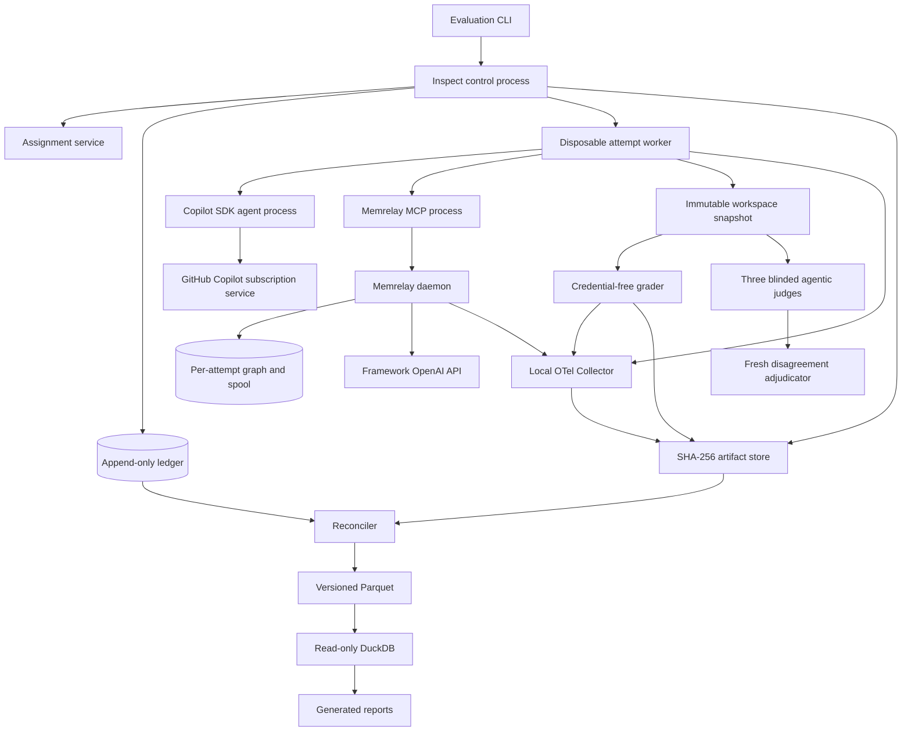
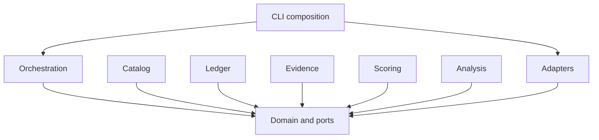
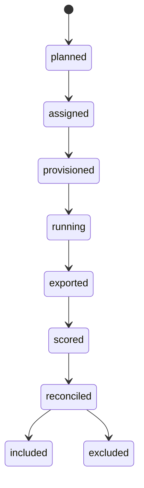
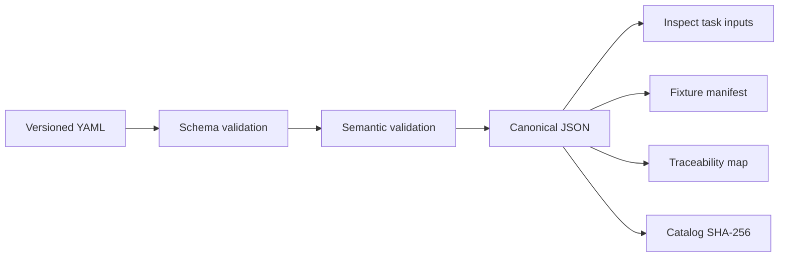

# Implementation Design - memrelay Evaluation Platform

## 1. Purpose and Scope

This document translates the architecture spine into buildable evaluator components. It is operational guidance for coding agents and evaluator engineers. If this document conflicts with an architecture decision, `ARCHITECTURE-SPINE.md` wins.

The evaluator will:

- Execute coding tasks through the official GitHub Copilot SDK under the current Copilot subscription.
- Use Inspect AI as local run orchestration and execution truth.
- Compare controlled memory treatments without presuming benefit.
- Evaluate the shipped daemon plus MCP product stratum separately from a direct `MemoryEngine` upper-bound stratum.
- Support immutable replay histories and separately randomized dynamic histories.
- Preserve native execution, telemetry, grading, workspace, cost, and lifecycle evidence.
- Produce reconciled Parquet analysis tables and read-only DuckDB analyses.
- Run synthetic or license-audited public tasks initially.

## 2. What Implementation Establishes, and What Experiments Establish

Implementing this design produces the complete evaluation system: executable scenarios, controlled treatment assignment, isolated Copilot trials, hybrid executable and agentic-panel grading, telemetry and cost capture, immutable evidence, statistical analysis, and release-gate reporting. Running its staged experiments is specifically intended to establish whether memrelay improves reliability, cost, and wall-clock efficiency; characterize safety and failure modes; quantify uncertainty and generalization; and determine whether predefined release gates pass.

Building the evaluator alone is not evidence that memrelay works. Efficacy, safety, economic-value, and release-fitness claims require completed, reconciled experiments from the relevant stages. The implementation must not:

- Treat successful evaluator construction, component tests, or an unreconciled trial as evidence of memrelay efficacy, safety, economic value, or release fitness.
- Turn the current TEA Markdown scenario table into execution by interpretation. That table remains a design source until compiled into the new executable catalog.
- Route task-agent inference through an Inspect model provider.
- Use an unofficial GitHub Copilot OpenAI-compatible endpoint.
- Permit SDK BYOK or another task-agent provider.
- Pool daemon/MCP results with direct-engine results.
- Pool immutable replay with dynamic-history results.
- Use DuckDB as operational state.
- Add evaluator dependencies to the memrelay wheel.
- Authorize private histories or cross-repository trials.
- Allow agentic judges to override executable failures, security blockers, or evidence-integrity failures.
- Treat existing retrieval or release-roundtrip fixtures as downstream efficacy evidence.

Current source contains `SessionDiscoveryPoller`, `RunObserveCapture`, and `LiveTailCapture`. Older statements that continuous capture is absent are stale. Reliability and release claims still require evaluator sentinel evidence.

## 3. Governing Architecture Decision Index

| AD | Implementation consequence |
| --- | --- |
| AD-01 | Keep domain types and ports independent of external SDKs. |
| AD-02 | Build a separate `evaluation/` Python project and lockfile. |
| AD-03 | Use independent protocol, assignment, cost, analysis, and claim records for the two treatment strata. |
| AD-04 | Preserve Inspect `.eval` and native JSON; keep the ledger thin. |
| AD-05 | Use append-only SQLite WAL, SHA-256 artifacts, Parquet, and read-only DuckDB. |
| AD-06 | Provision a fresh host-native environment for every attempt. |
| AD-07 | Implement immutable replay and dynamic history as distinct protocols. |
| AD-08 | Launch one disposable worker process per attempt. |
| AD-09 | Construct process-specific environment allowlists. |
| AD-10 | Compile versioned YAML to validated canonical execution artifacts. |
| AD-11 | Use opaque IDs and append lifecycle transitions. |
| AD-12 | Resolve arms only inside provisioning and redact exports. |
| AD-13 | Combine hard executable grading with a blinded, calibrated agentic judge panel for qualitative quality. |
| AD-14 | Layer OpenInference, mapped OTel GenAI Development fields, and `memrelay.eval.*`. |
| AD-15 | Require complete evidence reconciliation before inclusion. |
| AD-16 | Maintain separate Copilot, OpenAI, and local-resource ledgers. |
| AD-17 | Persist redacted configuration and use typed failures. |
| AD-18 | Permit only one authorized pre-exposure infrastructure retry. |
| AD-19 | Use official Copilot SDK and current Inspect custom-agent integration directly. |
| AD-20 | Use MCP for the product stratum and an isolated public engine API for the upper-bound stratum. |
| AD-21 | Test current observation source behavior rather than stale documentation. |
| AD-22 | Keep deterministic CI separate from explicit paid workflows. |
| AD-23 | Restrict initial evidence to synthetic or approved public data. |
| AD-24 | Fingerprint and block on the host execution environment. |
| AD-25 | Verify a second local evidence copy and restore path before paid pilots. |

## 4. Context and Process Topology



Inspect remains in the control process. It schedules tasks, enforces limits, owns `.eval` logs, and exports JSON. It does not provide the task model. The attempt worker calls the official Copilot SDK directly through an Inspect `@agent` implementation. If the pinned Inspect release requires a bridge, use its documented `agent_bridge()` function.

The memrelay daemon is a separate process in the product stratum. It remains sole writer of its graph. The direct-engine stratum uses an isolated in-process `MemoryEngine` with its own graph and never opens the product daemon graph.

## 5. Project and Package Tree

```text
evaluation/
  pyproject.toml
  uv.lock
  README.md
  src/
    memrelay_eval/
      __init__.py
      domain/
        ids.py
        entities.py
        states.py
        errors.py
        ports.py
        policies.py
      catalog/
        loader.py
        validation.py
        compiler.py
        canonical.py
        traceability.py
      ledger/
        schema.py
        sqlite.py
        repository.py
      orchestration/
        control.py
        assignment.py
        attempt.py
        worker.py
        history.py
        stages.py
        limits.py
      adapters/
        inspect/
          agent.py
          task.py
          export.py
        copilot/
          client.py
          catalog.py
          session.py
          events.py
        memrelay/
          product.py
          engine.py
          controls.py
        workspace/
          base.py
          worktree.py
          clone.py
        process/
          launcher.py
          environment.py
          cleanup.py
        telemetry/
          otel.py
          semantics.py
          reconcile.py
        artifacts/
          filesystem.py
        grader/
          executable.py
      evidence/
        manifest.py
        required.py
        reconcile.py
        costs.py
        parquet.py
      scoring/
        service.py
        blinding.py
        outcomes.py
      analysis/
        schemas.py
        queries.py
        reports.py
      cli/
        main.py
        commands.py
  schemas/
    scenario.schema.json
    traceability.schema.json
    artifact-manifest.schema.json
    evidence-manifest.schema.json
    cost-ledger.schema.json
    effective-config.schema.json
  catalog/
    catalog.yaml
    fixtures/
  collector/
    collector.yaml
    semantic-map.yaml
  tests/
    unit/
    contract/
    integration/
    fault/
    golden/
  artifacts/
    blobs/
    manifests/
    inspect/
    exports/
    traces/
    graders/
    costs/
    patches/
    parquet/
    reports/
```

`artifacts/` is ignored by Git, excluded from the product wheel, copied to the configured second-volume evidence root after every terminal run, and retained until every linked claim is formally retired. Publication, when authorized, exports a redacted hash-addressed bundle and never moves or replaces the local evidence of record.

## 6. Component Responsibilities and Dependencies

### 6.1 Domain

Owns:

- Opaque IDs and entity value objects.
- Lifecycle and retry rules.
- History protocol types.
- Treatment-stratum types.
- Inclusion and reconciliation policy.
- Typed errors and reason codes.
- Port definitions.

May import only the Python standard library.

### 6.2 Catalog

Owns:

- YAML parsing.
- JSON Schema validation.
- Semantic validation and referential closure.
- RFC 8785 canonical JSON projection.
- SHA-256 identity.
- Inspect task generation inputs.
- Fixture and traceability manifests.

May depend on domain. It must not import Inspect or Copilot SDK.

### 6.3 Ledger

Implements the domain ledger port over SQLite WAL. The Inspect control process is the sole ledger writer. Workers return typed transition intents through the orchestration boundary and never open SQLite directly. The ledger appends experiment, run, attempt, transition, artifact-link, and inclusion records. It never stores Inspect event streams, prompts, patches, trace bodies, or grader bodies.

### 6.4 Orchestration

Owns:

- Experiment and stage planning.
- Concealed assignment.
- Attempt provisioning.
- Bounded concurrency.
- Exposure classification.
- Retry authorization.
- Cleanup coordination.
- Calls to execution, workspace, treatment, evidence, and scoring ports.

It depends on domain ports, not concrete adapters.

### 6.5 Adapters

Adapters translate external systems into domain-owned records:

- Inspect orchestration and exports.
- Official GitHub Copilot SDK.
- Memrelay daemon/MCP and direct engine.
- Workspace and process isolation.
- OTel and Collector.
- Filesystem CAS.
- Executable benchmark graders.
- Blinded agentic-judge panel and disagreement adjudicator.

External SDK objects are converted at adapter boundaries.

### 6.6 Evidence

Owns artifact manifests, required-evidence matrices, cost records, reconciliation, Parquet materialization, and source-to-derived lineage.

### 6.7 Scoring

Owns blinded views, deterministic-grader invocation, agentic-panel invocation, calibration, inter-rater reliability, disagreement adjudication, outcome normalization, and hash-pinned scorer versions. It cannot access concealed assignment resolution.

### 6.8 Analysis

Reads reconciled Parquet only. It cannot mutate the ledger or raw evidence. Every generated table or report records its query or derivation hash and source table hashes.

### 6.9 Dependency Rules



Forbidden dependencies:

- `domain` to any other evaluator package.
- One adapter to another adapter.
- `analysis` to operational SQLite mutation.
- `scoring` to assignment resolution.
- `catalog` to live provider calls.
- Product source to `evaluation/`.

## 7. Design-Level Ports and Protocols

These signatures define intent, not mandatory final naming.

```python
from collections.abc import Mapping, Sequence
from pathlib import Path
from typing import Protocol

class LedgerPort(Protocol):
    def append_transition(self, transition: "RunTransition") -> None: ...
    def append_artifact_link(self, link: "ArtifactLink") -> None: ...
    def append_inclusion(self, decision: "InclusionDecision") -> None: ...
    def history(self, run_id: "RunId") -> Sequence["RunTransition"]: ...

class ArtifactStorePort(Protocol):
    def put_bytes(
        self,
        data: bytes,
        *,
        media_type: str,
        classification: str,
    ) -> "ArtifactRef": ...
    def open_verified(self, artifact: "ArtifactRef") -> bytes: ...
    def write_manifest(self, manifest: "ArtifactManifest") -> "ArtifactRef": ...

class ExecutionAuthorityPort(Protocol):
    async def execute(
        self,
        task: "CompiledTask",
        attempt: "AttemptSpec",
    ) -> "ExecutionExport": ...

class AgentRuntimePort(Protocol):
    async def list_models(self) -> "NativeModelCatalog": ...
    async def run_session(
        self,
        session: "AgentSessionSpec",
    ) -> "AgentTerminalRecord": ...

class TreatmentPort(Protocol):
    async def provision(self, spec: "TreatmentSpec") -> "TreatmentHandle": ...
    async def restore_history(
        self,
        handle: "TreatmentHandle",
        history: "HistoryBundle",
    ) -> None: ...
    async def collect_state(self, handle: "TreatmentHandle") -> Sequence["ArtifactRef"]: ...
    async def close(self, handle: "TreatmentHandle") -> None: ...

class WorkspacePort(Protocol):
    async def create(self, spec: "WorkspaceSpec") -> "WorkspaceHandle": ...
    async def freeze(self, handle: "WorkspaceHandle") -> "WorkspaceSnapshot": ...
    async def destroy(self, handle: "WorkspaceHandle") -> "CleanupRecord": ...

class AssignmentPort(Protocol):
    def assign(self, request: "AssignmentRequest") -> "OpaqueAssignment": ...
    def resolve_for_provisioning(
        self,
        assignment_id: "AssignmentId",
    ) -> "ResolvedTreatment": ...

class GraderPort(Protocol):
    async def grade(
        self,
        snapshot: "WorkspaceSnapshot",
        contract: "GraderContract",
    ) -> "GraderResult": ...

class TelemetryPort(Protocol):
    def start_attempt(self, context: "AttemptTelemetryContext") -> None: ...
    def finish_attempt(self, terminal: "AttemptTerminal") -> None: ...
    def flush(self, timeout_seconds: float) -> "TelemetryFlushRecord": ...

class ReconciliationPort(Protocol):
    def reconcile(
        self,
        run: "RunRecord",
        required: "RequiredEvidenceSet",
    ) -> "ReconciliationReport": ...
```

### 7.1 Product-Stratum Treatment Port

The product adapter:

1. Creates an isolated `MEMRELAY_HOME`.
2. Writes a pinned memrelay configuration.
3. Starts the daemon and verifies `health`.
4. Registers or supplies an isolated MCP configuration to the Copilot SDK session.
5. Uses the shipped `memory_recall`, `memory_detail`, and `memory_note` tools.
6. Collects graph, spool, daemon logs, MCP logs, health, and process records.
7. Stops the daemon and verifies cleanup.

It must not open the graph directly.

### 7.2 Direct-Engine Treatment Port

The direct adapter:

1. Creates an isolated memrelay configuration and graph path.
2. Calls `await MemoryEngine.from_config(cfg, ...)`.
3. Uses public async methods:
   - `note(content, namespace, repo=None, source=None, ...)`
   - `search(query, namespace, prefer_repo=None, *, prefer_agent=None)`
   - `detail(node_uuid, namespace)`
   - `health()`
   - `close()`
4. Converts returned plain dictionaries into domain records.
5. Never opens a graph used by a daemon.

This stratum excludes daemon socket, MCP transport, and MCP rendering overhead. Its claim IDs must say engine upper bound.

## 8. Domain Entities and State Machine

### 8.1 Core Entities

| Entity | Required identity and role |
| --- | --- |
| Experiment | Immutable protocol and catalog selection. |
| Protocol | History, assignment, endpoint, retry, and analysis contract. |
| Scenario | Atomic executable catalog item. |
| Task | Frozen repository revision, prompt, environment, budgets, and grader. |
| History | Ordered manifest of immutable or dynamically generated memory evidence. |
| Assignment | Opaque link from experimental unit to concealed arm. |
| Run | One assigned task or sequence under one protocol. |
| Attempt | One isolated execution of a run, including failed and retried attempts. |
| Artifact | Immutable bytes identified by SHA-256. |
| Evidence | Typed use of one or more artifacts for a required evidence class. |
| Endpoint | Frozen outcome definition. |
| Claim | Bounded statement linked to population, stratum, protocol, evidence, and gate. |
| CostEntry | Provider-specific usage or price record. |
| InclusionDecision | Terminal included or excluded status with reason and reconciliation hash. |

### 8.2 Lifecycle



Transitions append to the ledger. No row is updated to simulate progression. The lifecycle above belongs to the run. Attempt terminal classifications are immutable evidence attached to that run and do not create ad hoc run transitions.

An attempt has a separate terminal classification:

- `succeeded`
- `agent_failed`
- `timed_out`
- `provider_unavailable`
- `quota_exhausted`
- `grader_failed`
- `evidence_incomplete`
- `infrastructure_failed_pre_exposure`
- `infrastructure_failed_post_exposure`
- `cancelled_by_circuit_breaker`

Only `infrastructure_failed_pre_exposure` can be retried, once, when the protocol permits it.

### 8.3 Exposure Record

Every attempt records:

- Whether assignment was resolved.
- Whether memory state was provisioned.
- Whether the agent received the task.
- Whether any task-agent inference occurred.
- Whether any treatment tool call or direct retrieval occurred.
- The monotonic timestamp of first exposure.
- The evidence supporting classification.

Ambiguous exposure is treated as exposed.

## 9. Scenario Catalog and Compiler

### 9.1 Human-Authored Source

`evaluation/catalog/catalog.yaml` is the only hand-authored execution source. The existing TEA 161-row Markdown scenario table informs migration but is not executable and must not be parsed as runtime truth.

Required catalog-level fields:

```yaml
schema_version: "1.0.0"
catalog_version: "1.0.0"
catalog_id: "cat_<opaque>"
scenarios: []
```

Required scenario fields:

- `id`
- `title`
- `protocol_ids`
- `priority`
- `owner`
- `preconditions`
- `fixture_refs`
- `procedure`
- `expected_evidence`
- `pass_criteria`
- `allowed_retries`
- `risk_ids`
- `gate_ids`
- `endpoint_ids`
- `claim_ids`
- `data_classification`
- `network_policy`
- `resource_limits`
- `grader_ref`

Each scenario must have one injected condition, one procedure, and an objective verdict. Composite scenarios fail validation.

### 9.2 Fixture References

Each fixture reference includes:

- Opaque fixture ID.
- Relative source path.
- SHA-256.
- Media type.
- License and provenance record.
- Repository revision if applicable.
- Expected extraction path.
- Data classification.
- Redistribution policy.

### 9.3 Compiler Pipeline



Compiler requirements:

1. Reject duplicate or treatment-revealing IDs.
2. Resolve all fixture hashes.
3. Validate all referenced protocol, risk, gate, endpoint, evidence, and claim IDs.
4. Emit RFC 8785 canonical JSON with the digest field omitted during digest calculation.
5. Generate byte-identical outputs for identical inputs.
6. Reject manual modifications to generated outputs in CI.
7. Require major, minor, or patch version movement for breaking, additive, or content-only changes.
8. Generate Inspect task inputs without importing assignment resolution.
9. Generate opaque assignment requests, not treatment labels.
10. Preserve source location metadata for diagnostics.

All JSON identity bytes come from one shared RFC 8785 canonicalizer module. No package may implement its own sorted-key or serializer-specific identity projection.

## 10. Run and Attempt Lifecycle

### 10.1 Planning and Assignment

The control process:

1. Loads the compiled catalog by exact hash.
2. Loads a frozen protocol and model-catalog hash.
3. Creates opaque experiment, run, and assignment IDs.
4. Seals the assignment algorithm version, seed commitment, block definitions, ordered input hashes, and assignment-plan hash.
5. Appends `planned`.
6. Calls the assignment service.
7. Persists only opaque assignment identity in ordinary manifests.
8. Appends `assigned`.

### 10.2 Provisioning

The attempt worker:

1. Receives an attempt spec without a human-readable arm label.
2. Creates a fresh workspace.
3. Creates isolated cache and session roots.
4. Resolves the treatment inside the provisioning boundary.
5. Restores controlled history or initializes dynamic history state.
6. Creates process-specific environment allowlists.
7. Starts the Collector and required treatment processes.
8. Verifies health and parity hashes.
9. Emits a `provisioned` transition intent; the control process validates and appends it.

A mismatch before task exposure is a pre-exposure infrastructure failure.

### 10.3 Running and Export

The worker:

1. Emits a `running` transition intent; the control process validates and appends it.
2. Invokes the Inspect custom agent.
3. Executes the official Copilot SDK session.
4. Records native SDK events and terminal status.
5. Flushes telemetry.
6. Freezes the workspace.
7. Preserves Inspect `.eval`.
8. Runs Inspect native JSON export.
9. Stores all artifacts by SHA-256.
10. Emits an `exported` transition intent; the control process validates and appends it.

### 10.4 Scoring and Reconciliation

The control process:

1. Launches the credential-free grader over the frozen workspace snapshot.
2. Stores protected grader evidence separately.
3. Appends `scored`.
4. Runs evidence reconciliation.
5. Appends `reconciled`.
6. Appends exactly one `included` or `excluded` decision.

## 11. Memrelay Treatment Strata

### 11.1 Stratum P: Shipped Daemon Plus MCP

Purpose: estimate agent-facing product behavior, including daemon lifecycle, graph ownership, socket transport, MCP tool calls, formatting, and product overhead.

Requirements:

- Start a real isolated daemon.
- Reach memory only through MCP.
- Use the existing daemon methods `search`, `detail`, `note`, and `health`.
- Capture socket or loopback configuration.
- Capture MCP tool success, errors, and zero-result responses.
- Preserve daemon, spool, graph, MCP, and health artifacts.
- Test the configured observation mode.
- Keep current daemon single-writer ownership intact.

Product-stratum control arms must preserve equivalent tool visibility, schema, permissions, budgets, and accounting where required by the protocol.

### 11.2 Stratum E: Direct MemoryEngine Upper Bound

Purpose: estimate engine behavior without daemon transport or MCP rendering overhead.

Requirements:

- Use an isolated graph.
- Call the public `MemoryEngine` API directly.
- Freeze the retrieval-to-agent rendering contract used for the stratum.
- Record engine construction, health, note, search, detail, and close evidence.
- Never use the live product graph.
- Report separate endpoints, costs, and claims.
- Label every result as an engine upper bound, not product efficacy.

### 11.3 No Pooling

The compiler and analysis schemas require a `stratum_id`. A query attempting to aggregate strata without an explicit stratified operation must fail validation.

## 12. History Protocols

### 12.1 Controlled Immutable History

The controlled protocol:

- Builds history before treatment assignment exposure.
- Stores the bundle as immutable CAS artifacts.
- Includes ordered episodes, provenance, revisions, actors, scopes, validity, and expected graph inputs.
- Restores byte-identical inputs into every arm.
- Verifies a restore manifest and parity hash.
- Disables, discards, or separately records probe-time writes according to the protocol.
- Uses controlled-effect estimands only.

### 12.2 Dynamic History

The dynamic protocol:

- Assigns the entire sequence before episode one.
- Provisions a fresh isolated state for the sequence.
- Allows each assigned episode to alter later state.
- Treats the sequence or history as the experimental and analysis unit.
- Retains failures and attrition as assigned outcomes.
- Prohibits crossover and treatment-generated history reuse in a control arm.
- Uses total-policy sequence estimands only.

### 12.3 History Bundle Shape

```json
{
  "schema_version": "1.0.0",
  "history_id": "hist_<opaque>",
  "protocol_id": "proto_<opaque>",
  "mode": "controlled",
  "ordered_items": [
    {
      "position": 1,
      "artifact_sha256": "<sha256>",
      "actor_id": "actor_<opaque>",
      "scope": "session",
      "valid_from": "2026-08-05T00:00:00Z",
      "valid_to": null
    }
  ],
  "content_sha256": "<sha256>"
}
```

## 13. Copilot SDK Catalog and Model Pinning

### 13.1 Frozen SDK and Runtime Lock

Use `github-copilot-sdk==1.0.8`. The only accepted wheel is `github_copilot_sdk-1.0.8-py3-none-any.whl` with SHA-256 `7c3d868b73daa3a154ae6c1c5a2bd9301c47349c6b080f1ed77ba9027da3e0fa`.

Bootstrap runs `python -m copilot download-runtime`, records the SDK-bundled runtime version, binary SHA-256, transport, authentication mode, and signed-in subscription identity without credentials, then sets `COPILOT_SKIP_CLI_DOWNLOAD=1` for every trial. A missing or changed runtime is a blocking conformance failure, never an automatic download or substitution. Capture the complete native `CopilotClient.list_models()` response and canonical capability projection at bootstrap and experiment start.

### 13.2 Model Selection

Selection operates only on the archived native catalog and is fully automatic:

1. Reject models lacking the required tool, permission, context, event, cancellation, and session capabilities.
2. Run the frozen eight-task nonstudy qualification suite once per eligible model with identical prompts, tools, reasoning controls, and limits.
3. Rank by executable tasks passed, mean protected-check fraction, lower median active wall time, then lexicographic native model ID.
4. Set `M0` to the first ranked model.
5. Set `M1` to the first eligible model from a distinct reported family; omit with a recorded reason if none exists.
6. Set `M2` to the lowest median Copilot-credit model whose executable score is within 0.05 of `M0`; omit with a recorded reason if none exists.
7. Select three judge models by rank, maximizing distinct IDs and reported families while excluding the task-generator model where possible.
8. Freeze returned model IDs, capabilities, reasoning effort, context tier, qualification evidence, and runtime version in `model-lock.json`.

A missing or changed locked model pauses the stage and requires a new protocol version. No public documentation name or manual preference may substitute for this algorithm.

### 13.3 Agent Parity Hash

Before launch, hash:

- SDK and bundled runtime versions.
- Exact model ID.
- Reasoning effort and context tier.
- System and user prompt bytes.
- Tool schemas.
- Permission policy.
- Network policy.
- Limits and timeout.
- Workspace layout.
- Copilot built-in memory setting.
- Cross-session store setting.
- Retry policy.

Only treatment content or access may differ.

## 14. Inspect Custom Agent Integration

Use Inspect AI 0.3.252 as the verified seed. The adapter must use the official current custom-agent surface exposed by that pinned version:

- Register an `@agent` implementation when that is the supported direct surface.
- If the pinned Inspect release requires a bridge, use the documented `agent_bridge()` function.
- Call the official GitHub Copilot SDK directly inside the custom agent.
- Do not construct or call an Inspect model provider for task inference.
- Do not translate Copilot to an OpenAI-compatible endpoint.
- Do not expose GitHub authentication as `OPENAI_API_KEY`.
- Return native terminal state, event references, patch references, usage records, and typed failure to Inspect.
- Preserve Inspect limits, cancellation, task metadata, and native logging.

Design sketch:

```python
@agent
def copilot_sdk_agent() -> Agent:
    return CopilotSdkInspectAgent(runtime=copilot_runtime_port)

class CopilotSdkInspectAgent:
    async def run(self, task_state, tools) -> agent_result:
        session_spec = translate_task_state(task_state, tools)
        terminal = await runtime.run_session(session_spec)
        return translate_terminal_for_inspect(terminal)
```

The exact signature must follow the pinned official Inspect API. The adapter contract tests own translation behavior, while domain code remains independent of Inspect classes.

Required conformance evidence:

- Inspect schedules and terminates the custom agent.
- The official SDK performs all task inference.
- Zero Inspect provider model calls occur.
- The exact model and limits reach the SDK.
- Native SDK events survive export by artifact reference.
- Inspect `.eval` and JSON export agree on terminal status.
- Inspect execution status is authoritative, the native SDK terminal record is mandatory corroboration, and any disagreement blocks reconciliation.
- Cancellation and timeout preserve partial evidence.
- No hidden retry occurs.

## 15. Workspace, Process, and Credential Isolation

### 15.1 Workspace Isolation

Every attempt receives:

- Fresh git worktree where supported.
- Isolated temporary clone fallback where worktrees are unavailable.
- Unique workspace root.
- Unique agent session root.
- Unique `MEMRELAY_HOME`.
- Unique graph and spool.
- Unique socket, named resource, or loopback port.
- Unique model and extension caches unless a read-only preseed is explicitly protocol-approved.
- Unique telemetry resource identity.
- Unique artifact staging root.

Shared writable state across attempts is forbidden.

**[ASSUMPTION]** Worktree and clone providers can meet the same observable isolation contract. Contract tests must prove equivalence.

### 15.2 Process Environment Allowlists

| Process | Allowed credential domain | Explicitly prohibited |
| --- | --- | --- |
| Inspect control | None | GitHub token, OpenAI key |
| Copilot SDK worker | Host Copilot authentication only | `OPENAI_API_KEY`, `OPENAI_BASE_URL`, framework key |
| Memrelay framework daemon | Configured OpenAI key only | GitHub token, Copilot credential export |
| MCP thin client | None | OpenAI and GitHub secrets |
| Deterministic grader | None | All provider credentials |
| Agentic judge worker | Host Copilot authentication only | `OPENAI_API_KEY`, treatment labels, task-agent session state |
| Collector | None | All provider credentials |
| Analysis | None | All provider credentials |

The process launcher starts from a minimal allowlist, not inherited full environment. It scans workspace, logs, manifests, traces, prompts, tool outputs, and exported configuration for secret canaries.

### 15.3 Framework Fail-Closed Preflight

The product treatment protocol must not use the default `borrow-host` strategy because it would consume Copilot quota and blur inference domains. Before exposure, assert:

- `llm.strategy == "byo-key"`.
- The named API-key variable exists only in the daemon environment.
- The framework model equals `gpt-4.1-mini-2025-04-14`.
- The expected OpenAI base URL is pinned.
- The concrete client is the expected OpenAI-backed client.
- No strategy fallback selected `borrow-host`, `litellm`, or local unexpectedly.
- Agent and MCP environments contain no OpenAI key or base URL.

Any mismatch is a pre-exposure infrastructure failure.

### 15.4 Environment Fingerprint

Before assignment, capture OS/build, CPU, memory, storage class, power mode, Python/runtime versions, process limits, network policy, and the active background-load policy. Hash the canonical record and include it in blocking and parity evidence. A changed fingerprint creates a separate environment stratum.

## 16. Evidence Directory and Manifest

### 16.1 Layout

```text
artifacts/
  blobs/
    sha256/
      ab/
        <remaining-sha256>
  manifests/
    experiments/<experiment_id>.json
    runs/<run_id>.json
    attempts/<attempt_id>.json
    evidence/<evidence_id>.json
  inspect/
    <attempt_id>.eval.ref.json
  exports/
    <attempt_id>.inspect.json.ref.json
  traces/
    <attempt_id>.otlp.ref.json
  graders/
    <attempt_id>.grader.json.ref.json
  costs/
    <attempt_id>.cost.json.ref.json
  patches/
    <attempt_id>.patch.ref.json
  parquet/
    <dataset_version>/
  reports/
    <report_id>/
```

The path is an index and convenience. Artifact identity is the SHA-256 and manifest, not the path.

### 16.2 Artifact Manifest Shape

```json
{
  "schema_version": "1.0.0",
  "artifact_id": "art_<opaque>",
  "attempt_id": "attempt_<opaque>",
  "kind": "inspect_eval",
  "sha256": "<lowercase-sha256>",
  "size_bytes": 1234,
  "media_type": "application/octet-stream",
  "created_at": "2026-08-05T00:00:00Z",
  "producer": {
    "component": "inspect_adapter",
    "version": "0.3.252"
  },
  "classification": "synthetic",
  "contains_secrets": false,
  "source_artifact_ids": [],
  "retention_policy_id": "ret_<opaque>",
  "encryption": null
}
```

### 16.3 Attempt Evidence Manifest

Required references:

- Inspect `.eval`.
- Inspect native JSON export.
- Native Copilot SDK event artifact.
- Native terminal record.
- OTel trace export.
- Workspace baseline and terminal revision.
- Workspace patch.
- Treatment process logs and health.
- Graph and spool evidence where required.
- Grader contract and output.
- Individual judge records, panel aggregation, calibration results, and adjudication record where triggered.
- Cost ledgers.
- Redacted effective configuration.
- Model catalog and parity hashes.
- Cleanup record.
- Ledger transition digest.

Large prompts, code, patches, transcripts, candidates, and test bodies remain separate governed artifacts referenced by hash.

### 16.4 Durability and Restore

Before paid stages, configure a second independent local evidence root. After each terminal run, atomically copy and hash-verify the ledger snapshot, manifests, Inspect `.eval` and JSON records, and newly referenced CAS blobs. The default RPO is the active in-flight attempt and the default RTO is 24 hours. A restore drill must reconstruct ledger-to-artifact reachability before the pilot. Retain evidence until its linked claim is retired.

## 17. Telemetry Semantics

### 17.1 Transport

Use OpenTelemetry Python SDK and OTLP exporters 1.44.0 with `otelcol-contrib` 0.158.0 for Windows amd64. The accepted archive is `otelcol-contrib_0.158.0_windows_amd64.tar.gz` with SHA-256 `4314abde3c8acc67af58bb8d7611aa991fd80abe4a412695167f956d9fff3005`.

**[ASSUMPTION]** One Collector per evaluation invocation is sufficient when expected-record reconciliation and fail-closed inclusion are enforced.

### 17.2 Semantic Layers

1. **OpenTelemetry core:** trace, span, resource, status, timing, links, and transport.
2. **OpenInference 0.1.31:** stable agent, LLM, tool, retriever, and evaluator vocabulary.
   Framework OpenAI spans may use `openinference-instrumentation-openai` 0.1.53 after compatibility tests with the pinned OpenAI client.
3. **OTel GenAI Development:** accepted only through a versioned compatibility mapper. It is not a domain schema.
4. **`memrelay.eval.*`:** versioned evaluator semantics.

Required evaluator fields include:

- `memrelay.eval.schema_version`
- `memrelay.eval.experiment_id`
- `memrelay.eval.protocol_id`
- `memrelay.eval.run_id`
- `memrelay.eval.attempt_id`
- `memrelay.eval.scenario_id`
- `memrelay.eval.stratum_id`
- `memrelay.eval.history_mode`
- `memrelay.eval.provider`
- `memrelay.eval.credential_domain`
- `memrelay.eval.cost_source`
- `memrelay.eval.evidence_class`
- `memrelay.eval.exposure_state`
- `memrelay.eval.failure_code`

Treatment labels must not appear in agent-visible resources, baggage, prompts, or logs.

### 17.3 Span Classes

Expected span classes:

- Control and assignment.
- Provisioning and cleanup.
- Copilot SDK session and native model request.
- MCP tool request.
- Daemon dispatch.
- Memory write.
- Retrieval.
- Framework extraction or embedding.
- Grader execution.
- Agentic judge inspection and adjudication.
- Artifact persistence.
- Inspect export.
- Cost reconciliation.
- Evidence reconciliation.

The versioned evidence schema owns this required span-class registry. Every span must carry `memrelay.eval.attempt_id`. Use trace context where supported. When a closed process boundary cannot preserve parentage, use opaque correlation and span links. Do not fabricate parent-child relationships.

### 17.4 Provider Identity

Copilot and framework OpenAI spans must use different:

- Service names.
- Provider fields.
- Credential-domain fields.
- Cost-source fields.
- Resource identities.
- Ledgers.

Local embeddings and local resource spans must not claim an external provider.

### 17.5 Completeness

OTLP delivery is not proof of completeness. Reconciliation compares expected classes with:

- Native SDK events.
- Inspect records.
- Memrelay logs.
- Grader records.
- Artifact writes.
- Cost records.
- Ledger transitions.

Drop, duplicate, out-of-order, partial-success, and shutdown fault tests are mandatory.

## 18. Cost Ledgers

### 18.1 Common Entry Shape

```json
{
  "schema_version": "1.0.0",
  "cost_entry_id": "cost_<opaque>",
  "attempt_id": "attempt_<opaque>",
  "provider": "github_copilot",
  "credential_domain": "copilot_subscription",
  "source": "native_sdk_usage",
  "quantity": 1000,
  "unit": "input_token",
  "price_table_version": "price_<opaque>",
  "currency": "USD",
  "amount": null,
  "measurement": "metered",
  "observed_at": "2026-08-05T00:00:00Z"
}
```

### 18.2 Separate Ledgers

Maintain three logical ledgers:

1. Copilot subscription usage:
   - Input, cached input, output, reasoning, AI credits, tool calls, quota, throttle, and reset data where exposed.
   - Subscription allowance and incremental cash remain distinct.
2. Framework OpenAI:
   - Metered model, input, cached input, output, tool usage, service tier, region, price table, and actual API cost.
3. Local resources:
   - CPU time, peak and time-weighted memory, disk bytes and seconds, process time, Collector overhead, and storage.

The versioned cost schema owns the canonical unit vocabulary. Initial units include `input_token`, `cached_input_token`, `output_token`, `reasoning_token`, `ai_credit`, `tool_call`, `request`, `usd`, `cpu_second`, `byte_second`, `disk_byte`, and `wall_second`. Unit conversion occurs only through versioned conversion tables.

Unsupported fields are `unavailable`, never zero.

Every result can be repriced from quantities under versioned price tables. Do not add Copilot tokens and framework OpenAI tokens into one model-cost quantity.

## 19. Hybrid Scoring, Blinding, and Inclusion

### 19.1 Deterministic Scorer Process

The scorer receives:

- Immutable workspace snapshot.
- Frozen grader contract.
- Hash-pinned hidden tests and dependencies.
- Opaque run and attempt IDs.
- No treatment assignment.
- No provider credentials.
- Restricted network policy.

The scorer emits:

- Executable test results.
- Patch scope and tamper checks.
- Grader version and dependency hashes.
- Terminal status.
- Objective endpoint components.
- Artifact references.

### 19.2 Blinded Views

Blinding removes or transforms:

- Arm names and treatment codes.
- Memrelay-specific paths where they reveal treatment.
- Provider fields not needed by the rater.
- Tool names or timing fields that reveal assignment.
- Assignment-service records.

The unblinded source remains immutable and access-separated. Blinding transformations are deterministic, versioned, and tested for leakage.

### 19.3 Agentic Judge Panel

Qualitative solution quality is a co-primary endpoint, separate from executable correctness. Every primary-analysis candidate receives three independent judge assessments from fresh Copilot SDK sessions. Select distinct eligible pinned judge model IDs, and models different from the task generator, to the maximum extent allowed by the archived Copilot catalog. If three sufficiently distinct models are unavailable, label the panel homogeneous or partially homogeneous and apply a prospectively frozen stronger human-calibration threshold plus shared-bias sensitivity analysis. Judges receive the same deterministic blinded view, frozen rubric, and read-only inspection tools, but no treatment assignment, task-agent transcript identity, cost data, or other judge output.

The rubric scores requirement satisfaction not captured by tests, semantic appropriateness, maintainability, unnecessary complexity, repository fit, and evidence-supported confidence. Each judge must cite artifact locations and return structured criterion scores plus uncertainty. Judge model IDs, system prompts, rubric, tool schemas, decoding controls, presentation order, and runtime versions are hash-pinned.

Panel quality controls include randomized candidate order, duplicate items, sentinel items, a prospectively selected human-labeled calibration set, per-criterion agreement, intraclass correlation or weighted kappa as appropriate, judge drift checks, leave-one-judge-out sensitivity analysis, and generator-versus-judge model-family sensitivity analysis. Failure to meet the frozen reliability or shared-bias threshold blocks confirmatory qualitative claims.

### 19.4 Disagreement Adjudication

A fresh blinded adjudicator runs only when prospectively defined disagreement thresholds are crossed. It sees the candidate evidence and anonymized judge rationales, not treatment labels or judge identities. It must resolve each disputed criterion with citations. Original scores and rationales remain immutable; adjudication is an additional evidence record, never replacement.

### 19.5 Outcome Authority

Executable correctness and categorical blockers remain authoritative for hard pass/fail conditions. The agentic panel is authoritative for the distinct qualitative endpoint. Neither endpoint substitutes for the other, and panel scores cannot override failed tests, security violations, governance failures, or evidence-integrity failures.

### 19.6 Fail-Closed Inclusion

A run is eligible for inclusion only when reconciliation confirms:

- Valid assignment and lifecycle.
- Required Inspect `.eval`.
- Valid Inspect JSON export.
- Required native SDK evidence.
- Required telemetry classes.
- Complete grader evidence.
- Complete required panel, calibration, and adjudication evidence.
- Complete cost ledgers or explicit unavailable fields.
- Workspace patch and snapshot.
- Matching catalog, fixture, model, configuration, and parity hashes.
- No categorical security, governance, evidence-integrity, grading, or causal-validity failure.

Missing primary evidence yields exclusion or a blocked stage.

## 20. Retry and Error Handling

### 20.1 Error Shape

```python
@dataclass(frozen=True)
class EvaluationError(Exception):
    code: str
    category: str
    message: str
    retry_class: str
    exposure_state: str
    evidence_refs: tuple[str, ...]
```

Categories:

- `catalog`
- `configuration`
- `assignment`
- `workspace`
- `process`
- `authentication`
- `provider`
- `treatment`
- `telemetry`
- `grader`
- `evidence`
- `analysis`
- `governance`

### 20.2 Retry Rules

- One retry maximum.
- Retry must be authorized by the frozen protocol.
- Failure must be conclusively pre-exposure.
- Ambiguous exposure is treated as exposed and is not retryable.
- Retry receives a new attempt ID and fresh isolation.
- Original attempt remains immutable.
- Same assignment remains linked.
- No post-exposure retry.
- No best-of-N substitution.
- Inspect, SDK, memrelay, and grader internal retry behavior must be captured and bounded separately.

### 20.3 Circuit Breakers

Circuit breakers monitor:

- Copilot token and AI-credit envelope.
- Framework OpenAI input, output, and USD envelope.
- Local elapsed time.
- Per-run active time.
- Quota and throttle state.
- Model availability.
- Repeated infrastructure failure.
- Evidence-loss rate.

A circuit breaker stops new attempts and records terminal evidence for attempts already started.

## 21. Configuration

### 21.1 Sources

Configuration layers, highest precedence first:

1. Explicit CLI arguments for non-secrets.
2. Frozen protocol and stage configuration.
3. Evaluator configuration file.
4. Built-in safe defaults.

Environment variables are not a general configuration layer. They are reserved for credentials injected into the exact process that needs them.

### 21.2 Configuration Groups

- Catalog and schema locations.
- Artifact and ledger roots.
- Inspect limits and export settings.
- Copilot SDK runtime and catalog pins.
- Judge model, rubric, tool, calibration, and adjudication pins.
- Model selection and session parity.
- Treatment stratum and history mode.
- Workspace and process isolation.
- Memrelay product configuration.
- Framework OpenAI model and endpoint.
- Collector and semantic-map configuration.
- Grader and network policy.
- Stage quota, cost, and wall limits.
- Reconciliation requirements.
- Retention and data classification.

### 21.3 Effective Configuration

Before exposure:

1. Resolve all non-secret configuration.
2. Replace credential values with structured redaction markers.
3. Record the credential variable names and target process, not values.
4. Canonicalize and hash.
5. Persist as an artifact.
6. Add the hash to the parity record.

Configuration changes after assignment require a new protocol or attempt, never an in-place mutation.

## 22. CI and Paid Stages

### 22.1 Unpaid CI

CI must run without Copilot or OpenAI calls:

- Schema validation.
- Catalog compiler determinism.
- Referential closure and fixture hashes.
- Ledger append-only and migration tests.
- State-machine property tests.
- Assignment concealment tests.
- Workspace adapter contracts with fakes.
- Process environment allowlist tests.
- Inspect adapter contract with a fake agent runtime.
- Memrelay adapter deterministic tests.
- Grader and blinding tests.
- OTel semantic mapping tests.
- Telemetry drop, duplicate, and ordering tests.
- CAS put, get, rebuild, and corruption tests.
- Reconciliation fail-closed tests.
- Parquet roundtrip and DuckDB read-only tests.
- Cost-ledger schema and repricing tests.
- No-network smoke tests.

Existing retrieval and release-roundtrip tests remain bounded product regression evidence. They do not satisfy evaluator efficacy acceptance.

### 22.2 Explicit Paid Stages

| Stage | Envelope |
| --- | --- |
| Catalog and conformance | Native model snapshot and arm-blind qualification; not efficacy evidence |
| Integration | 32 runs: 8 synthetic scenarios x `YL/TR` x 2 repeats |
| Minimal blinded pilot | 128 assigned units across 16 tasks |
| Expanded primary | 512 assigned units across 32 tasks |
| Secondary generalization | At most 192 units across eligible `M1/M2` |
| Later cross-repository | 24 clusters, only after DG-R |

Each paid stage requires:

- Exact catalog, protocol, SDK, runtime, model, and price hashes.
- Approved token, AI-credit, API-cost, and wall caps.
- Quota and throttle handling.
- Arm-balanced order and concurrency.
- Complete reconciliation from the preceding stage.
- Explicit operator invocation or scheduled approval.
- No automatic promotion based only on process success.

Cross-repository execution remains disabled by default.

## 23. Implementation Epics and Acceptance Criteria

### Epic 1 - Project Skeleton, Domain, and Ledger

Build:

- Separate `evaluation/` project.
- Domain entities, IDs, state machine, errors, and ports.
- SQLite WAL append-only ledger.
- Sole-writer ledger transition-intent handling.
- CLI composition baseline.

Acceptance criteria:

- Evaluator dependencies are absent from the product wheel metadata.
- Domain imports only standard-library modules.
- Invalid lifecycle transitions fail.
- Existing transitions cannot be updated or deleted through the repository API.
- Retry attempts retain parent lineage.
- IDs contain no arm label.
- A crash and reopen preserves ledger history.

### Epic 2 - Scenario Catalog and Compiler

Build:

- YAML catalog schema.
- JSON Schema 2020-12 validation.
- Semantic validator.
- Canonical JSON and hashing.
- Fixture and traceability manifests.
- Generated Inspect task inputs.

Acceptance criteria:

- The same input generates byte-identical outputs.
- Duplicate, missing, composite, or unresolved scenarios fail.
- Every fixture hash resolves.
- Every P0 and P1 scenario maps to a gate and endpoint, safety, evidence, or claim ID.
- Hand-edited generated output fails CI.
- The TEA Markdown table is documented as non-executable and is not loaded by production code.

### Epic 3 - Artifact Store, Evidence, and Telemetry Baseline

Build:

- SHA-256 filesystem CAS.
- Artifact and attempt manifests.
- OTel 1.44.0 instrumentation.
- Collector 0.158.0 configuration and archive-digest verification.
- OpenInference 0.1.31 and `memrelay.eval.*` mapping.
- `openinference-instrumentation-openai` 0.1.53 for framework OpenAI spans, subject to pinned-client compatibility tests.
- OTel GenAI Development compatibility mapper.
- Reconciliation skeleton.

Acceptance criteria:

- Put and get verify exact hashes.
- Index rebuild reproduces manifest references.
- Corruption is detected.
- A second-root backup and restore drill reconstructs all terminal-run evidence.
- Provider identities cannot be conflated.
- Injected dropped, duplicate, out-of-order, and partial telemetry is detected.
- Missing required evidence prevents inclusion.
- Sensitive-field allowlist tests pass.

### Epic 4 - Copilot SDK and Inspect Integration

Build:

- `github-copilot-sdk==1.0.8` with wheel and bundled-runtime digest verification.
- Native model catalog capture.
- Official Inspect `@agent` and, only if required by the pinned release, documented `agent_bridge()`.
- Direct SDK session execution.
- Native event and terminal export.
- Model and parity pinning.

Acceptance criteria:

- A synthetic task completes through Inspect using the official SDK.
- Zero Inspect provider inference calls occur.
- No unofficial OpenAI-compatible Copilot endpoint exists in code or configuration.
- The complete native model response and canonical projection are hashed.
- Exact model ID and capabilities reach the SDK session.
- Model disappearance pauses rather than substitutes.
- `.eval`, JSON export, native events, and terminal status reconcile.
- The agent environment contains no OpenAI credential.

### Epic 5 - Isolation, Credentials, and Treatment Strata

Build:

- Worktree and clone workspace adapters.
- Process environment allowlists.
- Product daemon/MCP adapter.
- Direct-engine adapter.
- Controlled and dynamic history providers.
- Treatment parity hashing.

Acceptance criteria:

- Concurrent attempts share no writable workspace, graph, spool, socket, cache, or session root.
- Worktree and clone paths pass the same isolation contract.
- Product stratum reaches graph state only through daemon/MCP.
- Direct-engine stratum uses a separate graph and public API.
- Strata have separate protocol, cost, endpoint, and claim identifiers.
- Controlled histories restore byte-identically.
- Dynamic histories assign before episode one and preserve sequence lineage.
- Framework route fails closed instead of falling back to `borrow-host`.
- Credential canaries do not appear in prohibited surfaces.

### Epic 6 - Grading, Costs, and Reconciliation

Build:

- Credential-free deterministic-grader process.
- Three independent blinded Copilot SDK judge sessions plus a fresh disagreement adjudicator.
- Immutable workspace snapshots.
- Blinded views.
- Three separated cost ledgers.
- Complete required-evidence reconciliation.
- Inclusion decisions.

Acceptance criteria:

- Grader inputs and dependencies are hash-pinned.
- Judge prompts, models, rubric, tools, order randomization, calibration items, and outputs are hash-pinned.
- Judge-model diversity is maximized from the archived eligible catalog; any homogeneous panel is labeled and subject to stronger frozen bias gates.
- Every primary-analysis candidate has three independent structured judge records.
- Judges receive no treatment label, other judge output, or task-agent session state.
- Panel reliability meets the prospectively frozen threshold before qualitative confirmatory claims.
- Adjudication preserves all original judge evidence and cannot override categorical blockers.
- Hidden tests and treatment labels do not enter agent artifacts.
- Copilot, framework OpenAI, and local costs remain separately queryable.
- Unsupported usage fields are `unavailable`, not zero.
- Every included run has every required evidence class.
- Missing `.eval`, JSON export, trace class, grader, cost, patch, or transition fails closed.
- No post-exposure retry or favorable attempt substitution is accepted.

### Epic 7 - Parquet, DuckDB, Analysis, and Reports

Build:

- Versioned Arrow schemas.
- Reconciled Parquet materialization.
- Read-only DuckDB queries.
- Derived-table lineage.
- Generated local reports.

Acceptance criteria:

- Two independent readers preserve rows, types, nulls, units, and ordering keys.
- DuckDB cannot mutate operational evidence.
- Every derived table references source hashes and derivation hash.
- Queries reject unstratified pooling of product and engine results.
- Queries reject pooling of controlled and dynamic histories.
- Reports link claims to protocol, population, endpoint, evidence, and gate IDs.

### Epic 8 - Stage Controls, Faults, and Release Integration

Build:

- Paid-stage envelopes.
- Quota, token, cost, and wall circuit breakers.
- Arm-balanced scheduler.
- Fault-injection suite.
- Continuous-capture sentinel for current source paths.
- Bounded release evidence mapping.

Acceptance criteria:

- CI performs no paid provider calls.
- Paid workflows require explicit invocation and frozen limits.
- Stage caps of 32, 128, 512, at most 192, and gated 24 are enforced.
- Quota and throttle state is captured and balanced by order and concurrency.
- Circuit breakers stop new work without erasing active-attempt evidence.
- Current `SessionDiscoveryPoller` and configured replay or `LiveTailCapture` path receive sentinel coverage.
- Release claims remain bounded to passed evidence.
- Cross-repository execution cannot start before DG-R authorization.

## 24. Frozen Build and Experiment Contract

This section removes implementation discretion. An implementation that changes these defaults is a new protocol, not an interpretation of this design.

### 24.1 Runtime and Provider Lock

| Component | Frozen value | Required proof |
| --- | --- | --- |
| Python | 3.13 | Executable path, version, and environment hash |
| Copilot SDK | `github-copilot-sdk==1.0.8` | Wheel SHA-256 `7c3d868b73daa3a154ae6c1c5a2bd9301c47349c6b080f1ed77ba9027da3e0fa` |
| Copilot runtime | SDK-bundled runtime downloaded once during bootstrap | Version and binary SHA-256 in `runtime-lock.json`; later download disabled |
| Inspect AI | `0.3.252` | Package hash and adapter-contract result |
| OTel SDK/exporters | `1.44.0` | Lockfile hashes |
| OTel Collector | `otelcol-contrib` `0.158.0` Windows amd64 | Archive SHA-256 `4314abde3c8acc67af58bb8d7611aa991fd80abe4a412695167f956d9fff3005` |
| OpenInference | semantic conventions `0.1.31`; OpenAI instrumentation `0.1.53` | Lockfile hashes and semantic-map test |
| Framework LLM | `gpt-4.1-mini-2025-04-14` through direct OpenAI `byo-key` | Preflight record proving exact model, client, base URL, and daemon-only key |
| Framework pricing | USD per 1M tokens: input 0.40, cached input 0.10, output 1.60 | Dated price-table artifact; price changes reprice results but do not change quantities |
| Embeddings | Local `BAAI/bge-small-en-v1.5` | Model files and digest; no embedding API calls |
| Analysis | DuckDB `1.5.5`, PyArrow `25.0.0` | Lockfile hashes and roundtrip contract |

### 24.2 Fixed Statistical and Claim Policy

- Familywise alpha: `0.05`, controlled with Holm across confirmatory claim families.
- Target power: `0.80`. The 512-unit primary stage may support a confirmatory claim only when the frozen simulation demonstrates at least this power for its target margin. Otherwise it remains estimation evidence and enrollment does not silently expand.
- Reliability benefit: pass-rate risk-difference point estimate at least `+0.05` and simultaneous 95% lower confidence bound above `0`.
- Qualitative benefit: blinded panel score difference at least `+0.05` on the `[0,1]` scale and simultaneous 95% lower confidence bound above `0`.
- No-regression safety: one-sided 97.5% lower confidence bound above `-0.02`.
- Cost superiority: total-cost ratio point estimate at most `0.90`, simultaneous 95% upper confidence bound below `1.0`, and reliability plus qualitative lower bounds above their `-0.02` non-inferiority margins.
- Wall-time superiority: active-wall-time ratio point estimate at most `0.90`, simultaneous 95% upper confidence bound below `1.0`, and reliability plus qualitative lower bounds above their `-0.02` non-inferiority margins.
- Release fitness: at least one reliability, qualitative, cost, or wall-time benefit claim passes; every non-target primary outcome passes its non-inferiority bound; all categorical gates pass; and the claim is limited to the tested population, model, stratum, and history regime.
- Categorical stop: any confirmed credential leak, unauthorized data use, treatment contamination, hidden-test tamper, evidence hash mismatch, favorable retry substitution, or unreconciled authority conflict blocks the affected stage.
- Panel gate: weighted kappa or ICC at least `0.70`, human-calibration mean absolute score error at most `0.10`, and blinded arm-classifier 95% upper AUC bound at most `0.60`. Failure blocks qualitative claims.

Thresholds are frozen before the first study trial. Pilot results may retire a claim or show inadequate power; they may not weaken a threshold.

### 24.3 Stage Entry, Exit, and Stop Rules

| Stage | Entry | Exit | Stop or failure consequence |
| --- | --- | --- | --- |
| Bootstrap and conformance | Clean evaluator environment and valid subscription authentication | All runtime, catalog, credential, isolation, grader, judge, telemetry, CAS, restore, and reconciliation contracts pass | Repair and repeat conformance; no study enrollment |
| 32-run integration | Conformance bundle hash locked | At least 30 attempts are infrastructure-complete; every terminal attempt has complete reconciled evidence; zero categorical blockers | Repair defect and rerun the entire 32-run stage under a new stage ID |
| 128-unit blinded pilot | Integration exit bundle accepted | Evidence completeness at least 98%; panel and blinding gates pass; variance, ICC, attrition, and power simulation published without decoded threshold changes | Repair and run a fresh pilot; pilot outcomes never enter confirmation |
| 512-unit primary | Pilot gates pass and primary protocol plus holdout hashes are locked | Complete ITT analysis, simultaneous intervals, harm tails, Pareto surface, and claim-gate decisions | Any categorical blocker stops the affected family; inadequate power yields estimation-only result |
| Secondary generalization | Primary evidence reconciled; qualified `M1` or `M2` exists | 96 units per available secondary model, maximum 192 total, reported as separate model strata | Missing eligible model is recorded, not substituted |
| 24-cluster cross-repository | Primary stage complete and DG-R identity, authorization, provenance, revocation, deletion, cache, migration, backup, and restore gates all pass | Cluster-level ITT analysis with repository authorization evidence | Any governance failure disables the entire cross-repository stage |

### 24.4 Required CLI Workflow and Artifacts

Build in this dependency order:

1. Epic 1, project skeleton, domain types, run/attempt state machines, sole-writer ledger, and CLI composition.
2. Epic 2, scenario schema, RFC 8785 compiler, fixture manifests, and traceability.
3. Epic 3, CAS, evidence manifests, Collector, telemetry map, backup/restore, and reconciliation skeleton.
4. Epics 4 and 5 in parallel after Epics 1-3: Copilot/Inspect integration; workspace, credentials, treatment strata, and history providers.
5. Epic 6 after Epics 4-5: deterministic grader, agentic judge panel, costs, blinding, adjudication, and complete reconciliation.
6. Epic 7 after Epic 6: Parquet schemas, DuckDB analysis, intervals, gates, and reports.
7. Epic 8 after Epic 7: stage enforcement, circuit breakers, fault injection, sentinels, and release integration.

The first mergeable vertical slice is Epics 1-3 plus `bootstrap`, `compile-catalog`, and deterministic `conformance` using fake Copilot, OpenAI, and memrelay adapters. It must prove one synthetic run from catalog compilation through ledger, evidence, reconciliation, Parquet, and report without any paid call.

The implementation exposes these non-interactive commands:

1. `memrelay-eval bootstrap --backup-root <second-volume-path>` creates the evaluator environment, verifies that the backup root is on a different volume, downloads and hashes the Copilot runtime, verifies the Collector archive, executes a backup/restore probe, and writes `runtime-lock.json`.
2. `memrelay-eval lock-models` archives `list_models()`, executes qualification, and writes `model-lock.json`.
3. `memrelay-eval compile-catalog` validates YAML and emits RFC 8785 canonical tasks, fixtures, traceability, and `catalog-lock.json`.
4. `memrelay-eval conformance` runs all unpaid and bounded provider contracts and emits `conformance-report.json`.
5. `memrelay-eval run --stage integration|pilot|primary|secondary|cross-repo` refuses entry unless the preceding immutable exit bundle passes.
6. `memrelay-eval reconcile --stage <stage>` materializes the inclusion set and fails closed on missing evidence.
7. `memrelay-eval analyze --stage <stage>` reads reconciled Parquet only and emits versioned tables, intervals, diagnostics, and claim decisions.
8. `memrelay-eval report --stage <stage>` generates the local evidence-linked report.

Every command writes a manifest with input hashes, output hashes, runtime lock, protocol ID, and typed terminal status.

### 24.5 Explicit v1 Exclusions

Managed telemetry, cloud warehouses, third-party experiment trackers, interactive UI, and cloud graph backends are not deferred decisions. They are excluded from evaluator v1. Local files, SQLite, CAS, Parquet, DuckDB, and generated reports are the complete v1 platform.

## 25. Mandatory Conformance Proofs

- Both temporary-worktree and isolated-clone providers must pass the same workspace-isolation contract behind `WorkspacePort`.
- One local Collector per evaluator invocation must pass export, shutdown, drop, duplicate, out-of-order, partial-success, and reconciliation fault tests.
- The configured second-volume evidence root must pass atomic copy, hash verification, index rebuild, and restore within the 24-hour RTO.

Any failed proof blocks paid trials. No fallback topology is selected automatically.
