# memrelay architecture

This document describes memrelay's system design **as it exists on `main` today**
(version `0.1.0`, pre-alpha). Every component below is grounded in a real module —
paths are relative to the repository root. For the product contract and requirement
numbering (the `SPEC §` references) see [`SPEC.md`](../SPEC.md); for the storage-backend
decision see [ADR 0001](adr/0001-graph-backends.md).

> Where this document and [`README.md`](../README.md) disagree (e.g. the default graph
> backend), this document and the code are authoritative — parts of the README predate
> the LadybugDB switch (ADR 0001 / #76).

## What memrelay is

memrelay is a **thin memory layer** for AI coding agents. It sits below two load-bearing
dependencies and adds only the memory-domain glue between them:

- **[`traceforge`](https://github.com/dfinson/traceforge)** (PyPI `traceforge-toolkit`,
  pinned `>=0.1,<0.2` in [`pyproject.toml`](../pyproject.toml)) normalizes ~18 agents'
  raw session traces into a common `SessionEvent` model.
- **[`graphiti-core`](https://github.com/getzep/graphiti)** (pinned `>=0.29,<0.30`)
  supplies the knowledge-graph "brain": a bitemporal fact model, LLM entity/edge
  extraction, dedup, and reciprocal-rank-fusion (RRF) retrieval.

memrelay adds episode assembly, a durable spool, a config-driven graph engine, a
long-lived daemon, and an MCP server — so that memory made in one agent session is
recalled in another. `src/memrelay/__init__.py` states this seam explicitly and pins
`__version__`.

## Two-process model

memrelay runs as **two cooperating processes** plus a **one-shot observation command**:

| Process | Entry point | Role |
| --- | --- | --- |
| **Daemon** | `memrelay start` → detached `memrelay _serve` ([`daemon/lifecycle.py`](../src/memrelay/daemon/lifecycle.py)) | Long-lived. Sole owner of graph state (the single writer). Builds the real `MemoryEngine`, hosts the spool→engine ingester, and answers queries over a local socket. |
| **MCP server** | `memrelay mcp` ([`mcp/server.py`](../src/memrelay/mcp/server.py)) | Spawned by each agent as a stdio subprocess. Stateless — forwards every tool call to the daemon over the socket. Never touches the graph directly. |
| **`observe`** | `memrelay observe` ([`cli.py`](../src/memrelay/cli.py) → [`ingest/graphiti_sink.py`](../src/memrelay/ingest/graphiti_sink.py)) | One-shot. Replays one discovered session through the observation pipeline and writes composed episodes into the durable spool. |

**Why two processes?** memrelay's out-of-the-box graph backend is embedded LadybugDB,
opened with an exclusive, single-writer connection
(`AsyncConnection(db, max_concurrent_queries=1)` — ADR 0001 §D-3). Only one process may
own the graph (SPEC §6.5). The daemon is that owner; the per-agent MCP servers are thin
clients that reach it only through the socket. This is why the MCP server holds no state
and the daemon is the single writer.

The daemon's query contract is the `Backend` **Protocol** in
[`daemon/protocol.py`](../src/memrelay/daemon/protocol.py) — four async methods
`search` / `detail` / `note` / `health`. `MemoryEngine`
([`engine/graphiti.py`](../src/memrelay/engine/graphiti.py)) implements that Protocol and
is what the daemon injects by default (`DaemonRuntime._build_engine` →
`MemoryEngine.from_config`, in [`daemon/runtime.py`](../src/memrelay/daemon/runtime.py)).
A `StubBackend` also lives in `protocol.py`, but it is a reference/test double — the live
daemon runs the real engine.

## System diagram

```mermaid
flowchart LR
    subgraph obs["memrelay observe · one-shot process"]
        direction TB
        A[Host agent session trace] --> P[Provider · providers/]
        P -->|traceforge Source + Adapter| SE[SessionEvent stream]
        SE --> GS[GraphitiSink · ingest/graphiti_sink.py]
    end
    GS -->|composed EpisodeRecords| SP[(Durable spool<br/>ingest/spool.py<br/>~/.memrelay/spool/spool.db)]

    subgraph daemon["memrelay daemon · long-lived, single writer"]
        direction TB
        IN[Ingester · ingest/ingester.py] -->|await engine.note| ENG[MemoryEngine · engine/graphiti.py]
        DP[Query dispatch · daemon/protocol.py] --> ENG
        ENG --> BK[Backend seam · engine/backends/<br/>LadybugDB default]
    end
    SP --> IN
    BK --> G[(Knowledge graph<br/>embedded LadybugDB file)]

    subgraph mcp["memrelay mcp · per-agent stdio process"]
        direction TB
        AG[Host coding agent] -->|MCP stdio| TL[memory_recall / memory_detail / memory_note<br/>mcp/tools.py]
        TL --> DC[DaemonClient · mcp/client.py]
    end
    DC -->|newline-delimited JSON over UDS / loopback TCP| DP
```

## Write path (observation → memory)

The write path turns a host agent's activity into graph memory. **Today its producer is
the one-shot `memrelay observe` command**; the daemon runs the consuming half (the
ingester). The stages:

1. **Provider → `SessionEvent`.** A provider ([`providers/`](../src/memrelay/providers/))
   supplies the traceforge `Source` + `Adapter` that discover a session and normalize its
   raw trace into a `SessionEvent` stream (`providers/base.py` `AgentProvider`). The
   reference provider is Copilot (`providers/copilot.py`, `DEFAULT_PROVIDER_ID="copilot"`);
   a Claude Code provider also exists (`providers/claude_code.py`, #70). The registry
   (`providers/registry.py`) auto-detects the installed agent.
2. **Compose episodes.** `GraphitiSink`
   ([`ingest/graphiti_sink.py`](../src/memrelay/ingest/graphiti_sink.py)) is a traceforge
   `StorageSink` that **buffers** a run of events and **flushes a single composed
   `EpisodeRecord`** on structural boundary kinds (`tool.call.completed`, `turn.ended`,
   `session.idle`, `session.ended`), plus one deterministic summary episode on
   `session.ended`. Boundaries are derived from event *kinds* because the ML phase/boundary
   classifiers are off by default (see [Configuration](#configuration)).
3. **Durable spool.** Composed episodes are serialized as plain dicts
   (`ingest/episode.py`, fields fixed by `EPISODE_FIELDS`, with a content-derived
   `idempotency_key`) and appended to a crash-safe SQLite spool
   ([`ingest/spool.py`](../src/memrelay/ingest/spool.py)) at `~/.memrelay/spool/spool.db`.
   The spool is append-only with a single durable cursor, runs in WAL mode, and dedups via
   `INSERT OR IGNORE` on the idempotency key — so re-observing a session never
   double-ingests and a crash resumes exactly where it left off.
4. **Ingest into the graph.** The `Ingester`
   ([`ingest/ingester.py`](../src/memrelay/ingest/ingester.py)) is the long-lived reader
   half, hosted by the daemon as a background task
   (`daemon/runtime.py` `default_ingester_factory`). It drains the spool in batches, calls
   `MemoryEngine.note(content, namespace, repo)` per record, and checkpoints each row. It
   is **poison-tolerant** (a record that makes `note` raise is logged, skipped, and still
   checkpointed) and backs off when the spool is empty.
5. **Engine → graph.** `MemoryEngine.note` (`engine/graphiti.py`) calls
   `graphiti.add_episode(..., group_id=namespace)`, and graphiti extracts entities/edges
   into the backing graph.

> **Not yet implemented: continuous observation.** There is no background watcher tailing
> live sessions today. The daemon exposes a `sessions_observed` health counter, but nothing
> increments it (`daemon/runtime.py` `_Counters`), so it always reports `0`. `memrelay
> observe` is a *single-session, on-demand* capture (`cli.py` `_select_session` /
> `observe`); continuous multi-session observation is a later epic (#8).

## Read path (recall)

The read path answers an agent's memory queries:

1. **MCP tools.** The agent spawns `memrelay mcp`, which builds a `FastMCP` stdio server
   ([`mcp/server.py`](../src/memrelay/mcp/server.py) `run_stdio`) exposing exactly three
   tools ([`mcp/tools.py`](../src/memrelay/mcp/tools.py)): `memory_recall`,
   `memory_detail`, `memory_note`.
2. **Namespace/repo resolution.** Each tool resolves `(namespace, repo)` from the working
   directory's git remote ([`mcp/namespace.py`](../src/memrelay/mcp/namespace.py)): the
   namespace is the GitHub owner from `origin`'s `owner/name`, falling back to a
   `namespace_map` entry or the OS username for local-only repos. The `git` subprocess
   detaches its stdin to avoid a Windows stdio hang (#94).
3. **Daemon client → socket.** Tools call the thin
   `DaemonClient` ([`mcp/client.py`](../src/memrelay/mcp/client.py)), which sends one
   newline-delimited JSON request per call over the socket
   ([`daemon/transport.py`](../src/memrelay/daemon/transport.py)), with a timeout and a
   brief reconnect retry.
4. **Dispatch → engine.** The daemon parses the request and routes it
   (`daemon/protocol.py` `dispatch`) to the `MemoryEngine`. The tool→method mapping is:

   | MCP tool | Daemon method | `MemoryEngine` method |
   | --- | --- | --- |
   | `memory_recall` | `search` | `search` (RRF hybrid search over the namespace) |
   | `memory_detail` | `detail` | `detail` (a node plus its connected edges/episodes) |
   | `memory_note` | `note` | `note` (store an explicit fact) |

5. **Format for the agent.** Results come back as the wire schema
   (`{nodes, edges, scores}` / `{node, connected_edges, episodes}`) and are rendered to
   markdown by [`mcp/format.py`](../src/memrelay/mcp/format.py) (`format_as_map` /
   `format_detail`) before returning to the agent.

## Wire contract & cross-platform transport

The daemon socket is a **frozen contract** (`daemon/protocol.py`): newline-delimited JSON,
one object per line, methods `search` / `detail` / `note` / `health` (plus a
`__shutdown__` control message handled by the server, not the backend). Any response may
instead be an error envelope `{"error": {"type": ..., "message": ...}}`.

Transport is per-OS ([`daemon/transport.py`](../src/memrelay/daemon/transport.py),
`USE_LOOPBACK = sys.platform == "win32"`):

- **POSIX (Linux/macOS):** a Unix domain socket at `~/.memrelay/daemon.sock`
  (`chmod 0600`).
- **Windows:** asyncio has no Unix-socket support, so the daemon binds a `127.0.0.1`
  loopback port and records it in `~/.memrelay/daemon.port` for the client to read.

> SPEC §2 anticipates a Windows *named pipe*; the shipped implementation uses loopback TCP
> instead. This document follows the code.

Daemon liveness is determined by a cheap `health` round-trip, **not** by trusting the
`daemon.pid` file, so a stale PID from a crashed process reads as "not running" and
`start` is restart-safe (`daemon/lifecycle.py`).

## Module map

Every package lives under `src/memrelay/`:

| Package / module | Responsibility | Key files |
| --- | --- | --- |
| `cli.py` | Click command surface: `init`, `start`, `stop`, `status`, `observe`, `config`, `mcp`, hidden `_serve`. `forget` / `seed` are stubs. | `cli.py` |
| `config.py` | TOML-backed config dataclasses, path resolution, and the `MEMRELAY_*` env-override precedence. | `config.py` |
| `providers/` | The agent↔memrelay seam: traceforge `Source`+`Adapter`, LLM-strategy hint, and MCP registration, behind an `AgentProvider` ABC + registry. | `base.py`, `registry.py`, `copilot.py`, `claude_code.py` |
| `ingest/` | The write path: episode record (`episode.py`), durable spool (`spool.py`), spool→engine ingester (`ingester.py`), and the observation sink that composes episodes (`graphiti_sink.py`). | `episode.py`, `spool.py`, `ingester.py`, `graphiti_sink.py` |
| `engine/` | The graph engine: `MemoryEngine` wrapping graphiti-core, plus the local embedder. | `graphiti.py`, `embedder.py` |
| `engine/backends/` | The storage `Backend` seam + lazy registry; the embedded Ladybug driver and cloud adapters. | `base.py`, `registry.py`, `ladybug_backend.py`, `ladybug_driver.py`, `_deltas.py`, `_fts_extension.py`, `neo4j_backend.py`, `falkordb_backend.py`, `neptune_backend.py` |
| `engine/llm/` | Pluggable LLM strategy selection (`borrow-host` / `byo-key` / `local`). | `strategy.py`, `borrow_host.py`, `byo_key.py`, `local.py` |
| `daemon/` | The long-lived process: runtime orchestration, wire protocol + stub, socket transport, process lifecycle, and the socket server. | `runtime.py`, `protocol.py`, `transport.py`, `lifecycle.py`, `server.py` |
| `mcp/` | The stdio MCP server, its three tools, the thin daemon client, namespace/repo resolution, and result formatting. | `server.py`, `tools.py`, `client.py`, `namespace.py`, `format.py` |

## Graph backend seam

The graph store is chosen behind a formal `Backend` seam so it can change without touching
graphiti's brain or `MemoryEngine`'s public API:

- **Contract** (`engine/backends/base.py`): a `Backend` ABC with an `id` and one async
  `open_driver(cfg) -> GraphDriver`.
- **Lazy registry** (`engine/backends/registry.py`): `DEFAULT_BACKEND_ID = "ladybug"`, a
  static `id → module` map, and `resolve_backend(cfg.graph.backend)`. Resolution imports
  **only** the selected backend's module, so a default install never pulls any cloud client
  library.
- **Embedded default — LadybugDB** (`ladybug_backend.py` / `ladybug_driver.py`): a
  maintained, Kuzu-API/Cypher drop-in that persists an on-disk `.db` with no server. The
  driver deliberately **reports `provider = GraphProvider.KUZU`** so graphiti's
  Kuzu-dialect Cypher branches are reused verbatim, and applies a small set of
  integration deltas (`_deltas.py`) plus an FTS-extension prefetch (`_fts_extension.py`).
- **Cloud opt-ins** — `neo4j` / `falkordb` / `neptune` — are thin adapters over
  graphiti-core's own native drivers, selected by config and reading `[graph.connection]`.
  Neo4j needs no extra (graphiti hard-depends on the neo4j client); FalkorDB and Neptune
  ship as install extras. These are wiring-tested, not stood up in CI.

The full rationale (why Ladybug, why report `KUZU`, the deltas, the FTS-on-Linux fix) is
in [ADR 0001](adr/0001-graph-backends.md) and is not duplicated here.

## LLM & embeddings

The graph engine needs an LLM (for graphiti's extraction) and an embedder. Both default to
a **key-less** configuration.

**LLM strategies** ([`engine/llm/strategy.py`](../src/memrelay/engine/llm/strategy.py)),
selected by `config.llm.strategy`:

- **`borrow-host`** (default) — reuse the host agent's own model, so no API key is needed
  out of the box (`borrow_host.py`; `config.llm.host` defaults to `"copilot"`).
- **`byo-key`** — opt-in; uses a provider key named by `config.llm.api_key_env`
  (`byo_key.py`).
- **`local`** — a **deferred stub** (`local.py`); its `is_available` always returns `False`
  so it is never auto-selected (#64).

`select_llm_client` tries the requested strategy, then falls through
`borrow-host → byo-key → local`, and builds a client lazily even if none reports
availability — so `search`/`health` work with no LLM present and only `note`/extraction
surfaces a strategy-specific error when actually invoked. A key-less
`PassthroughCrossEncoder` (`engine/graphiti.py`) is injected so graphiti does not fall back
to its OpenAI reranker (recall uses RRF and never reranks).

**Embeddings** (`engine/embedder.py`, `engine/graphiti.py` `build_embedder`): local
fastembed `BAAI/bge-small-en-v1.5` by default (no key, cached under `~/.memrelay/models`);
OpenAI embeddings are available via byo-key.

## Configuration

Config is a set of TOML-backed dataclasses in
[`config.py`](../src/memrelay/config.py): `Config` → `GraphConfig` (+ optional
`GraphConnectionConfig`), `LLMConfig`, `EmbeddingsConfig`, `IngestConfig`. `load_config`
resolves values with this precedence (highest wins):

1. explicit keyword overrides,
2. `MEMRELAY_*` environment variables (`__` denotes nesting, e.g.
   `MEMRELAY_LLM__STRATEGY`),
3. the first config file found — `MEMRELAY_CONFIG`, else `$XDG_CONFIG_HOME/memrelay/`,
   `~/.config/memrelay/`, `~/.memrelay/config.toml`,
4. built-in defaults.

Zero-config is the design point: with no file present, defaults yield a working system
(backend `ladybug`, strategy `borrow-host`, local embeddings).

> **Opt-in ingest ML is off by default.** `IngestConfig.enable_phase` and
> `enable_boundary` both default to `False`, keeping the observation pipeline deterministic
> and offline (no ML inferencers at ingest time). `memrelay init` writes them as `false`.

## Key design decisions

- **Zero-config first run.** `memrelay init` (`cli.py`) creates the home, writes
  `config.toml`, registers the MCP server, and prefetches both the embedding model (#13)
  and the Ladybug FTS extension (#93) so the first `start` is offline. Both prefetches are
  non-fatal by contract — a failure only defers the download to first daemon use.
- **Borrowed host LLM.** No API keys out of the box (see above).
- **Durable, idempotent spool.** The write path survives crashes and never double-ingests
  (`ingest/spool.py`).
- **Cross-platform transport.** Unix domain socket on POSIX, loopback TCP on Windows
  (`daemon/transport.py`).
- **Frozen contracts.** The daemon wire schema (`daemon/protocol.py`), the episode dict +
  spool schema (`ingest/episode.py`, `ingest/spool.py`), and `namespace == graphiti
  group_id` are stable seams that independent work streams build against.

## Where traceforge & graphiti-core sit

memrelay owns the glue between two seams and little else:

- **Above the `SessionEvent` seam** sits **traceforge**: providers wrap its `Source` +
  `Adapter` (`providers/base.py`) and everything below `SessionEvent` — episode assembly,
  spool, engine, retrieval — is written once, agent-agnostic.
- **Below the graph seam** sits **graphiti-core**, injected via
  `Graphiti(graph_driver=...)` in `engine/graphiti.py`. memrelay supplies the storage
  driver (the `Backend` seam), the LLM client (the strategy seam), and the embedder;
  graphiti supplies the bitemporal fact model, extraction, dedup, and RRF retrieval.

## Current status (what is and isn't built)

Accurate as of `0.1.0`:

- **Implemented:** the CLI (except `forget`/`seed`), the config-driven `MemoryEngine` over
  embedded LadybugDB with local embeddings and the `borrow-host`/`byo-key` strategies, the
  daemon (owning the engine and hosting the ingester), the MCP stdio server with three
  tools, and Copilot session observation via `memrelay observe`.
- **Not yet built:** continuous multi-session observation (no live tailing today; #8),
  `memrelay forget` / `memrelay seed` (CLI stubs), the `local` LLM strategy (deferred,
  #64), and additional agent providers beyond Copilot/Claude Code. Cloud graph backends
  are wiring-tested only.

## Further reading

- [`SPEC.md`](../SPEC.md) — the product/spec contract (requirement numbering).
- [ADR 0001 — Graph backends](adr/0001-graph-backends.md) — the LadybugDB decision.
- [`docs/e0-spike.md`](e0-spike.md) — the de-risking spike for the Copilot ingestion path.
- [`docs/e4-engine-notes.md`](e4-engine-notes.md) — engine wiring notes against
  graphiti-core.
- [`docs/e6e7-skeleton-notes.md`](e6e7-skeleton-notes.md) — daemon + MCP walking-skeleton
  notes.
- [`CONTRIBUTING.md`](../CONTRIBUTING.md) — dev setup, tests, lint, and CI.
- [`RELEASING.md`](../RELEASING.md) — the packaging/release pipeline.
